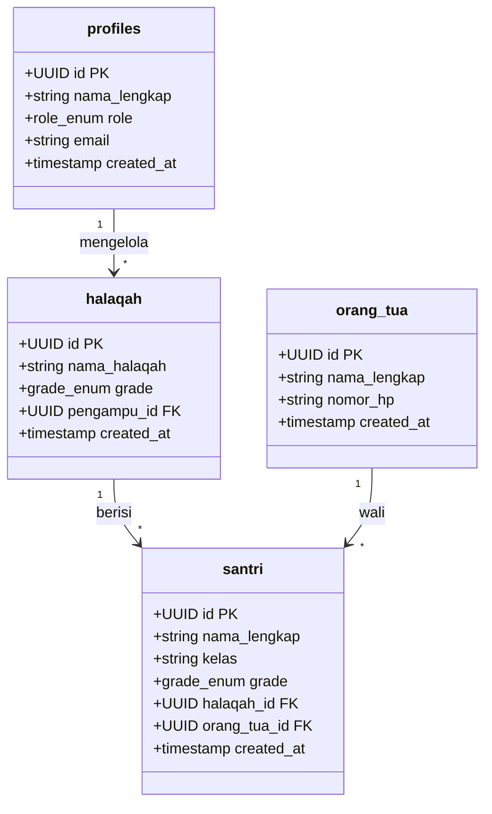
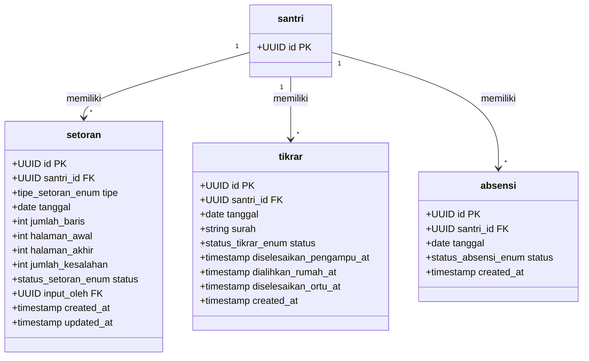
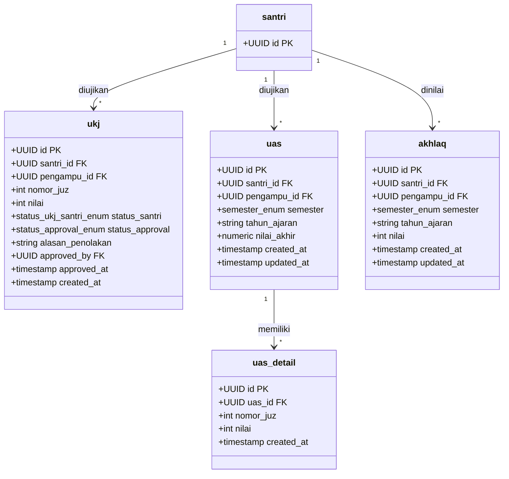
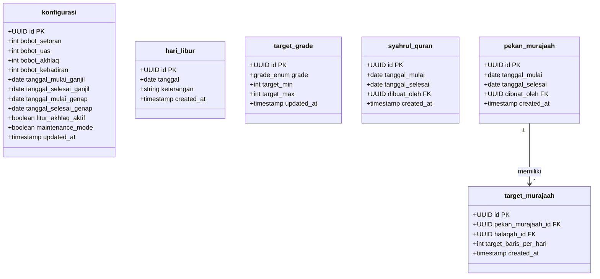
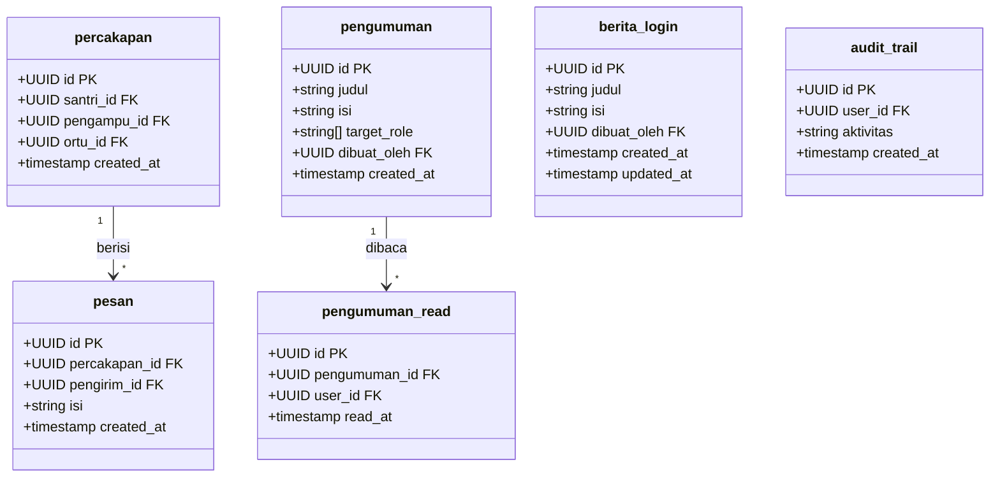

# Data Model

Document Version: vX.X
Project: [Nama Proyek]
Product: SI-Tahfiz
Status: Draft
Last Updated: [Tanggal]
Author: [Nama]
Source: srs.md

---

## 1. Overview

SI-Tahfiz adalah sistem informasi manajemen program Tahfiz Al-Qur'an untuk MTs TQ Jamilurrahman Yogyakarta. Data model ini mendefinisikan seluruh entitas, atribut, relasi, dan aturan bisnis yang menjadi fondasi database aplikasi. Database menggunakan PostgreSQL melalui layanan Supabase, dengan total 23 tabel yang dibagi ke dalam 10 kategori fungsional.

---

## 2. Class Diagram

### 2.1 Auth & Data Master



### 2.2 Setoran, Tikrar & Absensi



### 2.3 Ujian & Akhlaq



### 2.4 Periode Khusus & Konfigurasi



### 2.5 Komunikasi, Pengumuman & Audit



---

## 3. Entity Descriptions

### 3.1 profiles

| Attribute | Type | Constraint | Description |
|-----------|------|------------|-------------|
| id | UUID | PRIMARY KEY, REFERENCES auth.users(id) ON DELETE CASCADE | ID unik, sinkron dengan Supabase Auth |
| nama_lengkap | TEXT | NOT NULL | Nama lengkap pengguna |
| role | role_enum | NOT NULL | Role: tu, koordinator, pengampu, kepsek |
| email | TEXT | NOT NULL, UNIQUE | Email login |
| created_at | TIMESTAMPTZ | NOT NULL, DEFAULT NOW() | Waktu akun dibuat |

### 3.2 orang_tua

| Attribute | Type | Constraint | Description |
|-----------|------|------------|-------------|
| id | UUID | PRIMARY KEY, REFERENCES auth.users(id) ON DELETE CASCADE | ID unik, sinkron dengan Supabase Auth |
| nama_lengkap | TEXT | NOT NULL | Nama lengkap orang tua/wali |
| nomor_hp | TEXT | NOT NULL, UNIQUE | Nomor HP untuk login |
| created_at | TIMESTAMPTZ | NOT NULL, DEFAULT NOW() | Waktu akun dibuat |

### 3.3 halaqah

| Attribute | Type | Constraint | Description |
|-----------|------|------------|-------------|
| id | UUID | PRIMARY KEY, DEFAULT uuid_generate_v4() | ID unik halaqah |
| nama_halaqah | TEXT | NOT NULL | Nama halaqah |
| grade | grade_enum | NOT NULL | Grade: tahsin, takmil, tahfiz |
| pengampu_id | UUID | NOT NULL, FK → profiles(id) ON DELETE RESTRICT | Pengampu penanggung jawab |
| created_at | TIMESTAMPTZ | NOT NULL, DEFAULT NOW() | Waktu halaqah dibuat |

### 3.4 santri

| Attribute | Type | Constraint | Description |
|-----------|------|------------|-------------|
| id | UUID | PRIMARY KEY, DEFAULT uuid_generate_v4() | ID unik santri |
| nama_lengkap | TEXT | NOT NULL | Nama lengkap santri |
| kelas | TEXT | NOT NULL | Kelas santri (7/8/9) |
| grade | grade_enum | NOT NULL | Grade: tahsin, takmil, tahfiz |
| halaqah_id | UUID | NOT NULL, FK → halaqah(id) ON DELETE RESTRICT | Halaqah tempat santri |
| orang_tua_id | UUID | NULLABLE, FK → orang_tua(id) ON DELETE SET NULL | Akun orang tua/wali |
| created_at | TIMESTAMPTZ | NOT NULL, DEFAULT NOW() | Waktu data santri dibuat |

### 3.5 konfigurasi

| Attribute | Type | Constraint | Description |
|-----------|------|------------|-------------|
| id | UUID | PRIMARY KEY, DEFAULT uuid_generate_v4() | ID unik (hanya satu baris) |
| bobot_setoran | INTEGER | NOT NULL, DEFAULT 40 | Bobot nilai setoran harian (%) |
| bobot_uas | INTEGER | NOT NULL, DEFAULT 40 | Bobot nilai UAS (%) |
| bobot_akhlaq | INTEGER | NOT NULL, DEFAULT 10 | Bobot nilai akhlaq (%) |
| bobot_kehadiran | INTEGER | NOT NULL, DEFAULT 10 | Bobot nilai kehadiran (%) |
| tanggal_mulai_ganjil | DATE | NULLABLE | Tanggal mulai semester ganjil |
| tanggal_selesai_ganjil | DATE | NULLABLE | Tanggal selesai semester ganjil |
| tanggal_mulai_genap | DATE | NULLABLE | Tanggal mulai semester genap |
| tanggal_selesai_genap | DATE | NULLABLE | Tanggal selesai semester genap |
| fitur_akhlaq_aktif | BOOLEAN | NOT NULL, DEFAULT TRUE | Status fitur penilaian akhlaq |
| maintenance_mode | BOOLEAN | NOT NULL, DEFAULT FALSE | Status maintenance mode |
| updated_at | TIMESTAMPTZ | NOT NULL, DEFAULT NOW() | Waktu terakhir diperbarui |

### 3.6 hari_libur

| Attribute | Type | Constraint | Description |
|-----------|------|------------|-------------|
| id | UUID | PRIMARY KEY, DEFAULT uuid_generate_v4() | ID unik |
| tanggal | DATE | NOT NULL, UNIQUE | Tanggal hari libur |
| keterangan | TEXT | NOT NULL | Nama/keterangan hari libur |
| created_at | TIMESTAMPTZ | NOT NULL, DEFAULT NOW() | Waktu data dibuat |

### 3.7 target_grade

| Attribute | Type | Constraint | Description |
|-----------|------|------------|-------------|
| id | UUID | PRIMARY KEY, DEFAULT uuid_generate_v4() | ID unik |
| grade | grade_enum | NOT NULL, UNIQUE | Grade: tahsin, takmil, tahfiz |
| target_min | INTEGER | NOT NULL, CHECK > 0 | Target minimum baris per hari |
| target_max | INTEGER | NULLABLE, CHECK >= target_min | Target maksimum baris per hari (untuk Tahsin) |
| updated_at | TIMESTAMPTZ | NOT NULL, DEFAULT NOW() | Waktu terakhir diperbarui |

### 3.8 setoran

| Attribute | Type | Constraint | Description |
|-----------|------|------------|-------------|
| id | UUID | PRIMARY KEY, DEFAULT uuid_generate_v4() | ID unik setoran |
| santri_id | UUID | NOT NULL, FK → santri(id) ON DELETE CASCADE | Santri yang menyetor |
| tipe | tipe_setoran_enum | NOT NULL | Tipe: sabak, sabki, manzil |
| tanggal | DATE | NOT NULL | Tanggal setoran |
| jumlah_baris | INTEGER | NOT NULL, CHECK > 0 | Jumlah baris yang disetorkan |
| halaman_awal | INTEGER | NOT NULL | Halaman awal setoran |
| halaman_akhir | INTEGER | NOT NULL, CHECK >= halaman_awal | Halaman akhir setoran |
| jumlah_kesalahan | INTEGER | NULLABLE | Jumlah kesalahan saat setoran |
| status | status_setoran_enum | NOT NULL | Status: lulus, mengulang |
| input_oleh | UUID | NOT NULL, FK → auth.users(id) ON DELETE RESTRICT | User yang menginput |
| created_at | TIMESTAMPTZ | NOT NULL, DEFAULT NOW() | Waktu input |
| updated_at | TIMESTAMPTZ | NOT NULL, DEFAULT NOW() | Waktu terakhir diubah |

### 3.9 tikrar

| Attribute | Type | Constraint | Description |
|-----------|------|------------|-------------|
| id | UUID | PRIMARY KEY, DEFAULT uuid_generate_v4() | ID unik tikrar |
| santri_id | UUID | NOT NULL, FK → santri(id) ON DELETE CASCADE | Santri yang tikrar |
| tanggal | DATE | NOT NULL | Tanggal tikrar dibuat |
| surah | TEXT | NOT NULL | Surah/bagian yang ditirar |
| status | status_tikrar_enum | NOT NULL, DEFAULT 'wajib_sekolah' | Status alur tikrar |
| diselesaikan_pengampu_at | TIMESTAMPTZ | NULLABLE | Waktu ditandai selesai di sekolah |
| dialihkan_rumah_at | TIMESTAMPTZ | NULLABLE | Waktu dialihkan ke rumah |
| diselesaikan_ortu_at | TIMESTAMPTZ | NULLABLE | Waktu ditandai selesai di rumah |
| created_at | TIMESTAMPTZ | NOT NULL, DEFAULT NOW() | Waktu tikrar dibuat |

### 3.10 absensi

| Attribute | Type | Constraint | Description |
|-----------|------|------------|-------------|
| id | UUID | PRIMARY KEY, DEFAULT uuid_generate_v4() | ID unik absensi |
| santri_id | UUID | NOT NULL, FK → santri(id) ON DELETE CASCADE | Santri yang tidak hadir |
| tanggal | DATE | NOT NULL | Tanggal absensi |
| status | status_absensi_enum | NOT NULL | Status: alpha, sakit, izin |
| created_at | TIMESTAMPTZ | NOT NULL, DEFAULT NOW() | Waktu input |

### 3.11 ukj

| Attribute | Type | Constraint | Description |
|-----------|------|------------|-------------|
| id | UUID | PRIMARY KEY, DEFAULT uuid_generate_v4() | ID unik UKJ |
| santri_id | UUID | NOT NULL, FK → santri(id) ON DELETE CASCADE | Santri yang diuji |
| pengampu_id | UUID | NOT NULL, FK → profiles(id) ON DELETE RESTRICT | Pengampu yang menginput |
| nomor_juz | INTEGER | NOT NULL, CHECK 1-30 | Juz yang diujikan |
| nilai | INTEGER | NOT NULL, CHECK 0-100 | Nilai UKJ |
| status_santri | status_ukj_santri_enum | NOT NULL | Status hasil: lulus, mengulang |
| status_approval | status_approval_enum | NOT NULL, DEFAULT 'pending' | Status approval koordinator |
| alasan_penolakan | TEXT | NULLABLE | Alasan jika ditolak koordinator |
| approved_by | UUID | NULLABLE, FK → profiles(id) ON DELETE RESTRICT | Koordinator yang approve/reject |
| approved_at | TIMESTAMPTZ | NULLABLE | Waktu approve/reject |
| created_at | TIMESTAMPTZ | NOT NULL, DEFAULT NOW() | Waktu input |

### 3.12 uas

| Attribute | Type | Constraint | Description |
|-----------|------|------------|-------------|
| id | UUID | PRIMARY KEY, DEFAULT uuid_generate_v4() | ID unik UAS |
| santri_id | UUID | NOT NULL, FK → santri(id) ON DELETE CASCADE | Santri yang diuji |
| pengampu_id | UUID | NOT NULL, FK → profiles(id) ON DELETE RESTRICT | Pengampu yang menginput |
| semester | semester_enum | NOT NULL | Semester: ganjil, genap |
| tahun_ajaran | TEXT | NOT NULL | Tahun ajaran (contoh: 2024/2025) |
| nilai_akhir | NUMERIC(5,1) | NULLABLE | Rata-rata nilai seluruh juz |
| created_at | TIMESTAMPTZ | NOT NULL, DEFAULT NOW() | Waktu input |
| updated_at | TIMESTAMPTZ | NOT NULL, DEFAULT NOW() | Waktu terakhir diubah |

### 3.13 uas_detail

| Attribute | Type | Constraint | Description |
|-----------|------|------------|-------------|
| id | UUID | PRIMARY KEY, DEFAULT uuid_generate_v4() | ID unik detail UAS |
| uas_id | UUID | NOT NULL, FK → uas(id) ON DELETE CASCADE | Referensi ke header UAS |
| nomor_juz | INTEGER | NOT NULL, CHECK 1-30 | Juz yang diujikan |
| nilai | INTEGER | NOT NULL, CHECK 0-100 | Nilai per juz |
| created_at | TIMESTAMPTZ | NOT NULL, DEFAULT NOW() | Waktu input |

### 3.14 akhlaq

| Attribute | Type | Constraint | Description |
|-----------|------|------------|-------------|
| id | UUID | PRIMARY KEY, DEFAULT uuid_generate_v4() | ID unik penilaian akhlaq |
| santri_id | UUID | NOT NULL, FK → santri(id) ON DELETE CASCADE | Santri yang dinilai |
| pengampu_id | UUID | NOT NULL, FK → profiles(id) ON DELETE RESTRICT | Pengampu yang menilai |
| semester | semester_enum | NOT NULL | Semester: ganjil, genap |
| tahun_ajaran | TEXT | NOT NULL | Tahun ajaran |
| nilai | INTEGER | NOT NULL, CHECK 0-100 | Nilai akhlaq |
| created_at | TIMESTAMPTZ | NOT NULL, DEFAULT NOW() | Waktu input |
| updated_at | TIMESTAMPTZ | NOT NULL, DEFAULT NOW() | Waktu terakhir diubah |

### 3.15 syahrul_quran

| Attribute | Type | Constraint | Description |
|-----------|------|------------|-------------|
| id | UUID | PRIMARY KEY, DEFAULT uuid_generate_v4() | ID unik periode |
| tanggal_mulai | DATE | NOT NULL | Tanggal mulai Syahrul Quran |
| tanggal_selesai | DATE | NOT NULL, CHECK >= tanggal_mulai | Tanggal selesai Syahrul Quran |
| dibuat_oleh | UUID | NOT NULL, FK → profiles(id) ON DELETE RESTRICT | Koordinator yang menetapkan |
| created_at | TIMESTAMPTZ | NOT NULL, DEFAULT NOW() | Waktu dibuat |

### 3.16 pekan_murajaah

| Attribute | Type | Constraint | Description |
|-----------|------|------------|-------------|
| id | UUID | PRIMARY KEY, DEFAULT uuid_generate_v4() | ID unik periode |
| tanggal_mulai | DATE | NOT NULL | Tanggal mulai Pekan Murajaah |
| tanggal_selesai | DATE | NOT NULL, CHECK >= tanggal_mulai | Tanggal selesai Pekan Murajaah |
| dibuat_oleh | UUID | NOT NULL, FK → profiles(id) ON DELETE RESTRICT | Koordinator yang menetapkan |
| created_at | TIMESTAMPTZ | NOT NULL, DEFAULT NOW() | Waktu dibuat |

### 3.17 target_murajaah

| Attribute | Type | Constraint | Description |
|-----------|------|------------|-------------|
| id | UUID | PRIMARY KEY, DEFAULT uuid_generate_v4() | ID unik |
| pekan_murajaah_id | UUID | NOT NULL, FK → pekan_murajaah(id) ON DELETE CASCADE | Referensi ke periode Pekan Murajaah |
| halaqah_id | UUID | NOT NULL, FK → halaqah(id) ON DELETE CASCADE | Referensi ke halaqah |
| target_baris_per_hari | INTEGER | NOT NULL, CHECK > 0 | Target baris per hari selama Pekan Murajaah |
| created_at | TIMESTAMPTZ | NOT NULL, DEFAULT NOW() | Waktu dibuat |

### 3.18 percakapan

| Attribute | Type | Constraint | Description |
|-----------|------|------------|-------------|
| id | UUID | PRIMARY KEY, DEFAULT uuid_generate_v4() | ID unik thread percakapan |
| santri_id | UUID | NOT NULL, FK → santri(id) ON DELETE CASCADE | Santri yang dibicarakan |
| pengampu_id | UUID | NOT NULL, FK → profiles(id) ON DELETE RESTRICT | Pengampu dalam percakapan |
| ortu_id | UUID | NOT NULL, FK → orang_tua(id) ON DELETE RESTRICT | Orang tua dalam percakapan |
| created_at | TIMESTAMPTZ | NOT NULL, DEFAULT NOW() | Waktu thread dibuat |

### 3.19 pesan

| Attribute | Type | Constraint | Description |
|-----------|------|------------|-------------|
| id | UUID | PRIMARY KEY, DEFAULT uuid_generate_v4() | ID unik pesan |
| percakapan_id | UUID | NOT NULL, FK → percakapan(id) ON DELETE CASCADE | Thread percakapan |
| pengirim_id | UUID | NOT NULL, FK → auth.users(id) ON DELETE RESTRICT | Pengirim pesan |
| isi | TEXT | NOT NULL | Isi pesan (teks saja) |
| created_at | TIMESTAMPTZ | NOT NULL, DEFAULT NOW() | Waktu pesan dikirim |

### 3.20 pengumuman

| Attribute | Type | Constraint | Description |
|-----------|------|------------|-------------|
| id | UUID | PRIMARY KEY, DEFAULT uuid_generate_v4() | ID unik pengumuman |
| judul | TEXT | NOT NULL | Judul pengumuman |
| isi | TEXT | NOT NULL | Isi pengumuman |
| target_role | TEXT[] | NOT NULL | Array role penerima |
| dibuat_oleh | UUID | NOT NULL, FK → profiles(id) ON DELETE RESTRICT | Koordinator/TU yang membuat |
| created_at | TIMESTAMPTZ | NOT NULL, DEFAULT NOW() | Waktu dibuat |

### 3.21 pengumuman_read

| Attribute | Type | Constraint | Description |
|-----------|------|------------|-------------|
| id | UUID | PRIMARY KEY, DEFAULT uuid_generate_v4() | ID unik |
| pengumuman_id | UUID | NOT NULL, FK → pengumuman(id) ON DELETE CASCADE | Pengumuman yang dibaca |
| user_id | UUID | NOT NULL, FK → auth.users(id) ON DELETE CASCADE | User yang membaca |
| read_at | TIMESTAMPTZ | NOT NULL, DEFAULT NOW() | Waktu dibaca |

### 3.22 berita_login

| Attribute | Type | Constraint | Description |
|-----------|------|------------|-------------|
| id | UUID | PRIMARY KEY, DEFAULT uuid_generate_v4() | ID unik berita |
| judul | TEXT | NOT NULL | Judul berita |
| isi | TEXT | NOT NULL | Isi berita (teks saja, tanpa gambar) |
| dibuat_oleh | UUID | NOT NULL, FK → profiles(id) ON DELETE RESTRICT | Staff TU yang membuat |
| created_at | TIMESTAMPTZ | NOT NULL, DEFAULT NOW() | Waktu dibuat |
| updated_at | TIMESTAMPTZ | NOT NULL, DEFAULT NOW() | Waktu terakhir diubah |

### 3.23 audit_trail

| Attribute | Type | Constraint | Description |
|-----------|------|------------|-------------|
| id | UUID | PRIMARY KEY, DEFAULT uuid_generate_v4() | ID unik log |
| user_id | UUID | NOT NULL, FK → auth.users(id) ON DELETE RESTRICT | User yang melakukan aktivitas |
| aktivitas | TEXT | NOT NULL | Deskripsi aktivitas kritis |
| created_at | TIMESTAMPTZ | NOT NULL, DEFAULT NOW() | Waktu aktivitas terjadi |

---

## 4. Relationships

| Relationship | Type | Cardinality | Description |
|--------------|------|-------------|-------------|
| profiles → halaqah | One-to-Many | 1:N | Satu pengampu bisa mengelola banyak halaqah |
| halaqah → santri | One-to-Many | 1:N | Satu halaqah berisi banyak santri |
| orang_tua → santri | One-to-Many | 1:N | Satu orang tua bisa punya banyak anak |
| santri → setoran | One-to-Many | 1:N | Satu santri punya banyak record setoran |
| santri → tikrar | One-to-Many | 1:N | Satu santri punya banyak record tikrar |
| santri → absensi | One-to-Many | 1:N | Satu santri punya banyak record absensi |
| santri → ukj | One-to-Many | 1:N | Satu santri bisa ujian UKJ berkali-kali |
| santri → uas | One-to-Many | 1:N | Satu santri punya UAS per semester per tahun |
| uas → uas_detail | One-to-Many | 1:N | Satu UAS memiliki banyak detail nilai per juz |
| santri → akhlaq | One-to-Many | 1:N | Satu santri punya nilai akhlaq per semester per tahun |
| santri → percakapan | One-to-One | 1:1 | Satu thread unik per kombinasi santri + pengampu + ortu |
| percakapan → pesan | One-to-Many | 1:N | Satu thread percakapan berisi banyak pesan |
| pengumuman → pengumuman_read | One-to-Many | 1:N | Satu pengumuman bisa dibaca banyak user |
| pekan_murajaah → target_murajaah | One-to-Many | 1:N | Satu Pekan Murajaah punya target per halaqah |
| halaqah → target_murajaah | One-to-Many | 1:N | Satu halaqah punya target di banyak Pekan Murajaah |

---

## 5. Business Rules

### Setoran
- Tidak boleh ada duplikasi setoran dengan kombinasi `santri_id + tipe + tanggal` yang sama
- `halaman_akhir` harus lebih besar atau sama dengan `halaman_awal`
- `jumlah_baris` harus lebih dari 0
- Kolom `jumlah_kesalahan` hanya diisi untuk tipe `sabak` dan `sabki`, tidak untuk `manzil`
- Saat periode Syahrul Quran aktif, tipe `sabki` dan `manzil` tidak boleh diinput

### Tikrar
- Tikrar hanya dibuat oleh sistem secara otomatis saat setoran melebihi batas kesalahan
- Perpindahan status hanya boleh linear satu arah: `wajib_sekolah` → `selesai_sekolah` → `wajib_rumah` → `selesai_rumah`
- Tidak ada record duplikat untuk kombinasi `santri_id + tanggal + surah` yang sama

### Absensi
- Tidak ada record absensi dengan status `hadir` — tidak adanya record berarti hadir
- Tidak ada duplikasi untuk kombinasi `santri_id + tanggal` yang sama
- Hanya status `alpha` yang memicu notifikasi ke orang tua

### UKJ
- `nilai` harus antara 0 dan 100
- UKJ yang sudah `approved` tidak dapat diubah oleh pengampu
- Record UKJ yang `rejected` tetap tersimpan, tidak boleh dihapus
- `approved_by` dan `approved_at` hanya terisi jika `status_approval` bukan `pending`

### UAS
- Satu santri hanya boleh punya satu record UAS per `semester + tahun_ajaran`
- `nilai_akhir` dihitung otomatis sebagai rata-rata dari seluruh `uas_detail.nilai`
- `nilai_akhir` hanya terisi jika seluruh juz yang dipilih sudah memiliki nilai di `uas_detail`
- Tidak memerlukan approval koordinator

### Akhlaq
- Satu santri hanya boleh punya satu nilai akhlaq per `semester + tahun_ajaran`
- `nilai` harus antara 0 dan 100
- Hanya dapat diinput jika `konfigurasi.fitur_akhlaq_aktif = TRUE`

### Konfigurasi
- Total `bobot_setoran + bobot_uas + bobot_akhlaq + bobot_kehadiran` harus selalu sama dengan 100
- Tabel ini hanya boleh memiliki satu baris

### Target Grade
- `target_max` hanya boleh NULL untuk grade `takmil` dan `tahfiz`
- `target_max` harus lebih besar atau sama dengan `target_min` jika tidak NULL
- Setiap grade hanya boleh punya satu record

### Periode Khusus
- `tanggal_selesai` tidak boleh lebih awal dari `tanggal_mulai`
- Tidak boleh ada dua periode Syahrul Quran yang tumpang tindih tanggalnya
- Tidak boleh ada dua Pekan Murajaah yang tumpang tindih tanggalnya

### Percakapan & Pesan
- Kombinasi `santri_id + pengampu_id + ortu_id` harus unik
- Isi pesan hanya teks, tidak ada lampiran

### Audit Trail
- Record audit trail tidak dapat diubah atau dihapus secara manual
- Auto-delete berjalan otomatis untuk record yang berusia lebih dari 3 bulan
- Hanya mencatat aktivitas kritis: login, hapus data, approve UKJ, reject UKJ

---

## 6. Indexes

| Table | Index | Columns | Purpose |
|-------|-------|---------|---------|
| setoran | idx_setoran_santri_id | santri_id | Query setoran per santri |
| setoran | idx_setoran_tanggal | tanggal | Query setoran per tanggal |
| setoran | idx_setoran_santri_tipe_tanggal | santri_id, tipe, tanggal | Enforce unique constraint & query efisien |
| tikrar | idx_tikrar_santri_id | santri_id | Query tikrar per santri |
| tikrar | idx_tikrar_status | status | Filter tikrar berdasarkan status |
| absensi | idx_absensi_santri_id | santri_id | Query absensi per santri |
| absensi | idx_absensi_tanggal | tanggal | Query absensi per tanggal |
| ukj | idx_ukj_status_approval | status_approval | Filter UKJ pending approval |
| ukj | idx_ukj_santri_id | santri_id | Query UKJ per santri |
| uas_detail | idx_uas_detail_uas_id | uas_id | Query detail per UAS |
| santri | idx_santri_halaqah_id | halaqah_id | Query santri per halaqah |
| santri | idx_santri_orang_tua_id | orang_tua_id | Query santri per orang tua |
| pesan | idx_pesan_percakapan_id | percakapan_id | Query pesan per thread |
| pengumuman_read | idx_pengumuman_read_user_id | user_id | Query pengumuman yang sudah dibaca per user |
| audit_trail | idx_audit_trail_created_at | created_at | Query & auto-delete berdasarkan tanggal |
| audit_trail | idx_audit_trail_user_id | user_id | Query audit trail per user |

---

## 7. SQL DDL (PostgreSQL — Supabase)

> Full DDL tersedia di file `database_tahfidz.sql`. Berikut adalah DDL per kategori:

### Auth & Data Master

```sql
CREATE TABLE profiles (
  id           UUID PRIMARY KEY REFERENCES auth.users(id) ON DELETE CASCADE,
  nama_lengkap TEXT NOT NULL,
  role         role_enum NOT NULL,
  email        TEXT NOT NULL UNIQUE,
  created_at   TIMESTAMPTZ NOT NULL DEFAULT NOW()
);

CREATE TABLE orang_tua (
  id           UUID PRIMARY KEY REFERENCES auth.users(id) ON DELETE CASCADE,
  nama_lengkap TEXT NOT NULL,
  nomor_hp     TEXT NOT NULL UNIQUE,
  created_at   TIMESTAMPTZ NOT NULL DEFAULT NOW()
);

CREATE TABLE halaqah (
  id           UUID PRIMARY KEY DEFAULT uuid_generate_v4(),
  nama_halaqah TEXT NOT NULL,
  grade        grade_enum NOT NULL,
  pengampu_id  UUID NOT NULL REFERENCES profiles(id) ON DELETE RESTRICT,
  created_at   TIMESTAMPTZ NOT NULL DEFAULT NOW()
);

CREATE TABLE santri (
  id           UUID PRIMARY KEY DEFAULT uuid_generate_v4(),
  nama_lengkap TEXT NOT NULL,
  kelas        TEXT NOT NULL,
  grade        grade_enum NOT NULL,
  halaqah_id   UUID NOT NULL REFERENCES halaqah(id) ON DELETE RESTRICT,
  orang_tua_id UUID REFERENCES orang_tua(id) ON DELETE SET NULL,
  created_at   TIMESTAMPTZ NOT NULL DEFAULT NOW()
);
```

### Konfigurasi

```sql
CREATE TABLE konfigurasi (
  id                      UUID PRIMARY KEY DEFAULT uuid_generate_v4(),
  bobot_setoran           INTEGER NOT NULL DEFAULT 40,
  bobot_uas               INTEGER NOT NULL DEFAULT 40,
  bobot_akhlaq            INTEGER NOT NULL DEFAULT 10,
  bobot_kehadiran         INTEGER NOT NULL DEFAULT 10,
  tanggal_mulai_ganjil    DATE,
  tanggal_selesai_ganjil  DATE,
  tanggal_mulai_genap     DATE,
  tanggal_selesai_genap   DATE,
  fitur_akhlaq_aktif      BOOLEAN NOT NULL DEFAULT TRUE,
  maintenance_mode        BOOLEAN NOT NULL DEFAULT FALSE,
  updated_at              TIMESTAMPTZ NOT NULL DEFAULT NOW(),
  CONSTRAINT bobot_total_100 CHECK (
    bobot_setoran + bobot_uas + bobot_akhlaq + bobot_kehadiran = 100
  )
);

CREATE TABLE hari_libur (
  id         UUID PRIMARY KEY DEFAULT uuid_generate_v4(),
  tanggal    DATE NOT NULL UNIQUE,
  keterangan TEXT NOT NULL,
  created_at TIMESTAMPTZ NOT NULL DEFAULT NOW()
);

CREATE TABLE target_grade (
  id         UUID PRIMARY KEY DEFAULT uuid_generate_v4(),
  grade      grade_enum NOT NULL UNIQUE,
  target_min INTEGER NOT NULL,
  target_max INTEGER,
  updated_at TIMESTAMPTZ NOT NULL DEFAULT NOW(),
  CONSTRAINT target_min_positive CHECK (target_min > 0),
  CONSTRAINT target_max_gte_min CHECK (target_max IS NULL OR target_max >= target_min)
);
```

### Setoran & Tikrar

```sql
CREATE TABLE setoran (
  id               UUID PRIMARY KEY DEFAULT uuid_generate_v4(),
  santri_id        UUID NOT NULL REFERENCES santri(id) ON DELETE CASCADE,
  tipe             tipe_setoran_enum NOT NULL,
  tanggal          DATE NOT NULL,
  jumlah_baris     INTEGER NOT NULL,
  halaman_awal     INTEGER NOT NULL,
  halaman_akhir    INTEGER NOT NULL,
  jumlah_kesalahan INTEGER,
  status           status_setoran_enum NOT NULL,
  input_oleh       UUID NOT NULL REFERENCES auth.users(id) ON DELETE RESTRICT,
  created_at       TIMESTAMPTZ NOT NULL DEFAULT NOW(),
  updated_at       TIMESTAMPTZ NOT NULL DEFAULT NOW(),
  CONSTRAINT unique_setoran_per_hari UNIQUE (santri_id, tipe, tanggal),
  CONSTRAINT jumlah_baris_positive CHECK (jumlah_baris > 0),
  CONSTRAINT halaman_valid CHECK (halaman_akhir >= halaman_awal)
);

CREATE TABLE tikrar (
  id                       UUID PRIMARY KEY DEFAULT uuid_generate_v4(),
  santri_id                UUID NOT NULL REFERENCES santri(id) ON DELETE CASCADE,
  tanggal                  DATE NOT NULL,
  surah                    TEXT NOT NULL,
  status                   status_tikrar_enum NOT NULL DEFAULT 'wajib_sekolah',
  diselesaikan_pengampu_at TIMESTAMPTZ,
  dialihkan_rumah_at       TIMESTAMPTZ,
  diselesaikan_ortu_at     TIMESTAMPTZ,
  created_at               TIMESTAMPTZ NOT NULL DEFAULT NOW(),
  CONSTRAINT unique_tikrar UNIQUE (santri_id, tanggal, surah)
);
```

### Absensi & Akhlaq

```sql
CREATE TABLE absensi (
  id         UUID PRIMARY KEY DEFAULT uuid_generate_v4(),
  santri_id  UUID NOT NULL REFERENCES santri(id) ON DELETE CASCADE,
  tanggal    DATE NOT NULL,
  status     status_absensi_enum NOT NULL,
  created_at TIMESTAMPTZ NOT NULL DEFAULT NOW(),
  CONSTRAINT unique_absensi_per_hari UNIQUE (santri_id, tanggal)
);

CREATE TABLE akhlaq (
  id           UUID PRIMARY KEY DEFAULT uuid_generate_v4(),
  santri_id    UUID NOT NULL REFERENCES santri(id) ON DELETE CASCADE,
  pengampu_id  UUID NOT NULL REFERENCES profiles(id) ON DELETE RESTRICT,
  semester     semester_enum NOT NULL,
  tahun_ajaran TEXT NOT NULL,
  nilai        INTEGER NOT NULL,
  created_at   TIMESTAMPTZ NOT NULL DEFAULT NOW(),
  updated_at   TIMESTAMPTZ NOT NULL DEFAULT NOW(),
  CONSTRAINT unique_akhlaq_per_semester UNIQUE (santri_id, semester, tahun_ajaran),
  CONSTRAINT nilai_akhlaq_valid CHECK (nilai >= 0 AND nilai <= 100)
);
```

### Ujian

```sql
CREATE TABLE ukj (
  id               UUID PRIMARY KEY DEFAULT uuid_generate_v4(),
  santri_id        UUID NOT NULL REFERENCES santri(id) ON DELETE CASCADE,
  pengampu_id      UUID NOT NULL REFERENCES profiles(id) ON DELETE RESTRICT,
  nomor_juz        INTEGER NOT NULL,
  nilai            INTEGER NOT NULL,
  status_santri    status_ukj_santri_enum NOT NULL,
  status_approval  status_approval_enum NOT NULL DEFAULT 'pending',
  alasan_penolakan TEXT,
  approved_by      UUID REFERENCES profiles(id) ON DELETE RESTRICT,
  approved_at      TIMESTAMPTZ,
  created_at       TIMESTAMPTZ NOT NULL DEFAULT NOW(),
  CONSTRAINT nilai_ukj_valid CHECK (nilai >= 0 AND nilai <= 100),
  CONSTRAINT nomor_juz_valid CHECK (nomor_juz >= 1 AND nomor_juz <= 30)
);

CREATE TABLE uas (
  id           UUID PRIMARY KEY DEFAULT uuid_generate_v4(),
  santri_id    UUID NOT NULL REFERENCES santri(id) ON DELETE CASCADE,
  pengampu_id  UUID NOT NULL REFERENCES profiles(id) ON DELETE RESTRICT,
  semester     semester_enum NOT NULL,
  tahun_ajaran TEXT NOT NULL,
  nilai_akhir  NUMERIC(5,1),
  created_at   TIMESTAMPTZ NOT NULL DEFAULT NOW(),
  updated_at   TIMESTAMPTZ NOT NULL DEFAULT NOW(),
  CONSTRAINT unique_uas_per_semester UNIQUE (santri_id, semester, tahun_ajaran)
);

CREATE TABLE uas_detail (
  id         UUID PRIMARY KEY DEFAULT uuid_generate_v4(),
  uas_id     UUID NOT NULL REFERENCES uas(id) ON DELETE CASCADE,
  nomor_juz  INTEGER NOT NULL,
  nilai      INTEGER NOT NULL,
  created_at TIMESTAMPTZ NOT NULL DEFAULT NOW(),
  CONSTRAINT unique_juz_per_uas UNIQUE (uas_id, nomor_juz),
  CONSTRAINT nilai_uas_valid CHECK (nilai >= 0 AND nilai <= 100),
  CONSTRAINT nomor_juz_uas_valid CHECK (nomor_juz >= 1 AND nomor_juz <= 30)
);
```

### Periode Khusus

```sql
CREATE TABLE syahrul_quran (
  id              UUID PRIMARY KEY DEFAULT uuid_generate_v4(),
  tanggal_mulai   DATE NOT NULL,
  tanggal_selesai DATE NOT NULL,
  dibuat_oleh     UUID NOT NULL REFERENCES profiles(id) ON DELETE RESTRICT,
  created_at      TIMESTAMPTZ NOT NULL DEFAULT NOW(),
  CONSTRAINT tanggal_syahrul_valid CHECK (tanggal_selesai >= tanggal_mulai)
);

CREATE TABLE pekan_murajaah (
  id              UUID PRIMARY KEY DEFAULT uuid_generate_v4(),
  tanggal_mulai   DATE NOT NULL,
  tanggal_selesai DATE NOT NULL,
  dibuat_oleh     UUID NOT NULL REFERENCES profiles(id) ON DELETE RESTRICT,
  created_at      TIMESTAMPTZ NOT NULL DEFAULT NOW(),
  CONSTRAINT tanggal_murajaah_valid CHECK (tanggal_selesai >= tanggal_mulai)
);

CREATE TABLE target_murajaah (
  id                    UUID PRIMARY KEY DEFAULT uuid_generate_v4(),
  pekan_murajaah_id     UUID NOT NULL REFERENCES pekan_murajaah(id) ON DELETE CASCADE,
  halaqah_id            UUID NOT NULL REFERENCES halaqah(id) ON DELETE CASCADE,
  target_baris_per_hari INTEGER NOT NULL,
  created_at            TIMESTAMPTZ NOT NULL DEFAULT NOW(),
  CONSTRAINT unique_target_per_halaqah UNIQUE (pekan_murajaah_id, halaqah_id),
  CONSTRAINT target_baris_positive CHECK (target_baris_per_hari > 0)
);
```

### Komunikasi

```sql
CREATE TABLE percakapan (
  id          UUID PRIMARY KEY DEFAULT uuid_generate_v4(),
  santri_id   UUID NOT NULL REFERENCES santri(id) ON DELETE CASCADE,
  pengampu_id UUID NOT NULL REFERENCES profiles(id) ON DELETE RESTRICT,
  ortu_id     UUID NOT NULL REFERENCES orang_tua(id) ON DELETE RESTRICT,
  created_at  TIMESTAMPTZ NOT NULL DEFAULT NOW(),
  CONSTRAINT unique_percakapan UNIQUE (santri_id, pengampu_id, ortu_id)
);

CREATE TABLE pesan (
  id            UUID PRIMARY KEY DEFAULT uuid_generate_v4(),
  percakapan_id UUID NOT NULL REFERENCES percakapan(id) ON DELETE CASCADE,
  pengirim_id   UUID NOT NULL REFERENCES auth.users(id) ON DELETE RESTRICT,
  isi           TEXT NOT NULL,
  created_at    TIMESTAMPTZ NOT NULL DEFAULT NOW()
);
```

### Pengumuman & Berita

```sql
CREATE TABLE pengumuman (
  id          UUID PRIMARY KEY DEFAULT uuid_generate_v4(),
  judul       TEXT NOT NULL,
  isi         TEXT NOT NULL,
  target_role TEXT[] NOT NULL,
  dibuat_oleh UUID NOT NULL REFERENCES profiles(id) ON DELETE RESTRICT,
  created_at  TIMESTAMPTZ NOT NULL DEFAULT NOW()
);

CREATE TABLE pengumuman_read (
  id            UUID PRIMARY KEY DEFAULT uuid_generate_v4(),
  pengumuman_id UUID NOT NULL REFERENCES pengumuman(id) ON DELETE CASCADE,
  user_id       UUID NOT NULL REFERENCES auth.users(id) ON DELETE CASCADE,
  read_at       TIMESTAMPTZ NOT NULL DEFAULT NOW(),
  CONSTRAINT unique_pengumuman_read UNIQUE (pengumuman_id, user_id)
);

CREATE TABLE berita_login (
  id          UUID PRIMARY KEY DEFAULT uuid_generate_v4(),
  judul       TEXT NOT NULL,
  isi         TEXT NOT NULL,
  dibuat_oleh UUID NOT NULL REFERENCES profiles(id) ON DELETE RESTRICT,
  created_at  TIMESTAMPTZ NOT NULL DEFAULT NOW(),
  updated_at  TIMESTAMPTZ NOT NULL DEFAULT NOW()
);
```

### Audit Trail

```sql
CREATE TABLE audit_trail (
  id         UUID PRIMARY KEY DEFAULT uuid_generate_v4(),
  user_id    UUID NOT NULL REFERENCES auth.users(id) ON DELETE RESTRICT,
  aktivitas  TEXT NOT NULL,
  created_at TIMESTAMPTZ NOT NULL DEFAULT NOW()
);
```

---

## 8. Traceability

| Entity | SRS Reference | Feature |
|--------|---------------|---------|
| profiles | F-01 | Autentikasi & Manajemen Akun |
| orang_tua | F-01 | Autentikasi & Manajemen Akun |
| halaqah | F-17 | Manajemen Sistem (Staff TU) |
| santri | F-17 | Manajemen Sistem (Staff TU) |
| konfigurasi | F-12, F-17 | Nilai Akhir Semester, Manajemen Sistem |
| hari_libur | F-11, F-17 | Rekap Semester, Manajemen Sistem |
| target_grade | F-18 | Grade Santri (Marhalah) |
| setoran | F-02, F-03 | Setoran Harian, Setoran Manzil |
| tikrar | F-04 | Tikrar |
| absensi | F-07 | Absensi & Notifikasi Alpha |
| ukj | F-05 | Ujian Kenaikan Juz |
| uas | F-06 | Ujian Akhir Semester |
| uas_detail | F-06 | Ujian Akhir Semester |
| akhlaq | F-08 | Penilaian Akhlaq |
| syahrul_quran | F-09 | Periode Syahrul Quran |
| pekan_murajaah | F-10 | Pekan Murajaah |
| target_murajaah | F-10 | Pekan Murajaah |
| percakapan | F-13 | Pesan Pengampu–Orang Tua |
| pesan | F-13 | Pesan Pengampu–Orang Tua |
| pengumuman | F-14 | Pengumuman |
| pengumuman_read | F-14 | Pengumuman |
| berita_login | F-15 | Berita Halaman Login |
| audit_trail | F-16 | Audit Trail |
