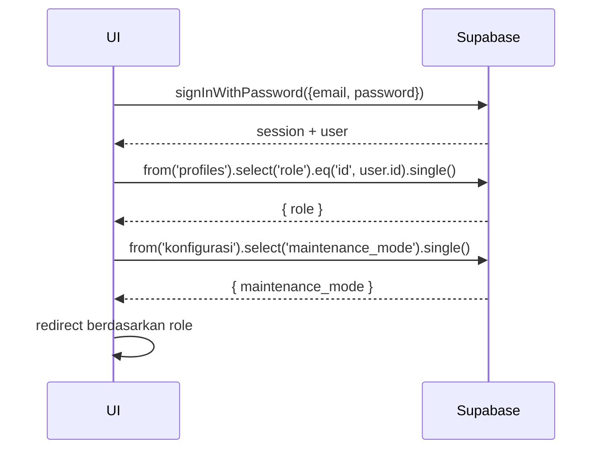

---

# UC-001 — Login Email

Document Version: v1.0
Use Case ID: UC-001
Use Case Name: Login Email
File Path: ./sys_uc_001.md
Status: Draft
Actors: TU, Koordinator, Pengampu, Kepsek
Complexity: 🟢 Simple
Tabel Utama: profiles

## Purpose

User internal melakukan login menggunakan email dan password. Setelah login, sistem membaca role dari tabel `profiles` dan redirect ke halaman beranda sesuai role.

## Preconditions

- Akun sudah dibuat oleh Staff TU di `profiles` dan `auth.users`.
- Supabase client sudah terinisialisasi.
- Maintenance mode tidak aktif (atau user adalah TU).

## Main Flow

1. UI menampilkan form email dan password di `/login`.
2. User mengisi dan menekan "Masuk".
3. UI memanggil `supabase.auth.signInWithPassword({ email, password })`.
4. UI mengambil role dari `profiles` berdasarkan `user.id`.
5. UI redirect sesuai role:
   - `tu` → `/tu/akun`
   - `koordinator` → `/koordinator/beranda`
   - `pengampu` → `/pengampu/beranda`
   - `kepsek` → `/kepsek/dashboard`
6. Jika `konfigurasi.maintenance_mode = true` dan role bukan `tu` → redirect ke `/maintenance`.

## Alternate / Error Flows

- Kredensial salah → tampilkan "Email atau password salah".
- Field kosong → tampilkan "Field ini wajib diisi".
- Maintenance aktif + bukan TU → redirect ke `/maintenance` setelah login berhasil.

## Sequence Diagram



## API Contract (Supabase SDK)

```javascript
const { data, error } = await supabase.auth.signInWithPassword({
  email: 'user@example.com',
  password: 'secret123'
});

const { data: profile } = await supabase
  .from('profiles')
  .select('role')
  .eq('id', data.user.id)
  .single();

const { data: config } = await supabase
  .from('konfigurasi')
  .select('maintenance_mode')
  .single();
```

## Data Model

- `profiles` — id, email, nama_lengkap, role, created_at
- `konfigurasi` — maintenance_mode

## Validation Rules

- email: required, format email valid
- password: required, minimal 8 karakter

## Security & Permissions

- RLS `profiles`: user hanya boleh SELECT row miliknya sendiri (`auth.uid() = id`).
- RLS `konfigurasi`: semua authenticated user boleh SELECT.

## Traceability

User Flow: userflow_uc_001.md
SRS: F-01

---
