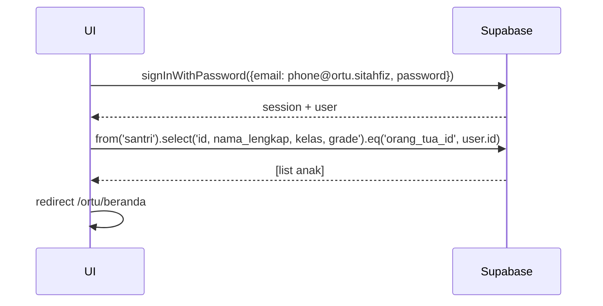

# UC-002 — Login Nomor HP

Document Version: v1.0
Use Case ID: UC-002
Use Case Name: Login Nomor HP
File Path: ./sys_uc_002.md
Status: Draft
Actors: Orang Tua / Wali
Complexity: 🟢 Simple
Tabel Utama: orang_tua

## Purpose

Orang Tua melakukan login menggunakan nomor HP dan password di halaman `/login/ortu`. Nomor HP disimpan sebagai email palsu di Supabase Auth.

## Preconditions

- Akun Orang Tua sudah dibuat oleh Staff TU.
- Nomor HP terdaftar di sistem.
- Supabase client sudah terinisialisasi.

## Main Flow

1. UI menampilkan form nomor HP dan password di `/login/ortu`.
2. User mengisi dan menekan "Masuk".
3. UI mengkonversi nomor HP ke format email palsu: `08xxx@ortu.sitahfiz`.
4. UI memanggil `supabase.auth.signInWithPassword`.
5. Supabase Auth memvalidasi kredensial.
6. UI redirect ke `/ortu/beranda`.
7. UI mengambil daftar anak yang terhubung ke akun ini.

## Alternate / Error Flows

- Nomor HP atau password salah → tampilkan "Nomor HP atau password salah".
- Field kosong → tampilkan "Field ini wajib diisi".
- Maintenance aktif → redirect ke `/maintenance` setelah login berhasil.

## Sequence Diagram



## API Contract (Supabase SDK)

```javascript
const phoneAsEmail = `${nomorHP}@ortu.sitahfiz`;

const { data, error } = await supabase.auth.signInWithPassword({
  email: phoneAsEmail,
  password: 'secret123'
});

const { data: anakList } = await supabase
  .from('santri')
  .select('id, nama_lengkap, kelas, grade')
  .eq('orang_tua_id', data.user.id);
```

## Data Model

- `orang_tua` — id, nama_lengkap, nomor_hp, created_at
- `santri` — id, nama_lengkap, kelas, grade, orang_tua_id

## Validation Rules

- nomor_hp: required, numerik, minimal 10 digit
- password: required, minimal 8 karakter

## Security & Permissions

- RLS `orang_tua`: user hanya boleh SELECT row miliknya (`auth.uid() = id`).
- RLS `santri`: orang tua hanya boleh SELECT santri miliknya (`orang_tua_id = auth.uid()`).

## Traceability

User Flow: userflow_uc_002.md
SRS: F-01

---
