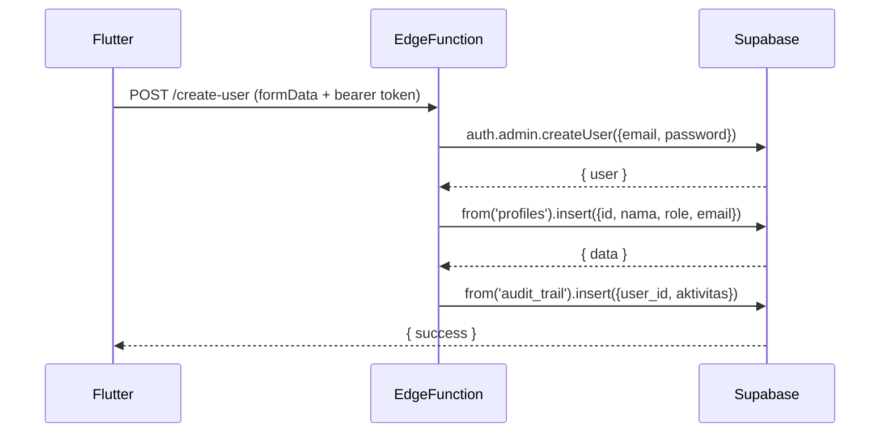

# UC-004 — CRUD Akun Pengguna

Document Version: v1.0
Use Case ID: UC-004
Use Case Name: CRUD Akun Pengguna
File Path: ./sys_uc_004.md
Status: Draft
Actors: Staff TU
Complexity: 🟡 Medium
Tabel Utama: profiles, orang_tua, audit_trail

## Purpose

Staff TU mengelola seluruh akun pengguna: membuat, melihat, mengedit, reset password, dan menghapus akun untuk semua role termasuk Orang Tua. Operasi `auth.admin.*` membutuhkan `SERVICE_ROLE_KEY` dan tidak boleh dipanggil langsung dari Flutter client. Operasi ini wajib dilakukan melalui Supabase Edge Function (Deno).

## Preconditions

- Staff TU sudah login.
- Berada di screen `/tu/akun`.

## Main Flow

**Create:**
1. TU menekan "Tambah Akun", mengisi form (nama, role, email/HP, password awal).
2. Flutter client memanggil Supabase Edge Function `create-user` dengan data form.
3. Edge Function memanggil `supabaseAdmin.auth.admin.createUser()` menggunakan SERVICE_ROLE_KEY.
4. Edge Function insert data profil ke `profiles` atau `orang_tua` sesuai role.
5. Edge Function catat ke `audit_trail`.

**Read:**
1. UI mengambil semua data dari `profiles` dan `orang_tua`.
2. Ditampilkan dalam tabel dengan filter role dan pencarian nama.

**Update:**
1. TU menekan "Edit", mengubah data, menekan "Simpan".
2. UI update baris di `profiles` atau `orang_tua` langsung via Supabase client.

**Reset Password:**
1. TU menekan "Reset Password", mengisi password baru.
2. Flutter client memanggil Edge Function `reset-password` dengan userId dan password baru.
3. Edge Function memanggil `supabaseAdmin.auth.admin.updateUserById()`.

**Delete:**
1. TU menekan "Hapus" → konfirmasi.
2. Flutter client memanggil Edge Function `delete-user` dengan userId.
3. Edge Function memanggil `supabaseAdmin.auth.admin.deleteUser()`.
4. Cascade delete otomatis hapus baris di `profiles`/`orang_tua`.
5. Edge Function catat ke `audit_trail`.

## Alternate / Error Flows

- Email/nomor HP sudah terdaftar → Edge Function mengembalikan error, UI tampilkan "Email/nomor HP sudah digunakan".
- Field wajib kosong → tampilkan error per field di sisi client sebelum memanggil Edge Function.

## Sequence Diagram



## API Contract

```dart
// Flutter client — panggil Edge Function
final response = await Supabase.instance.client.functions.invoke(
  'create-user',
  body: {
    'nama_lengkap': 'Nama User',
    'role': 'pengampu',
    'email': 'user@example.com',
    'password': 'password123',
  },
);

// Edge Function (Deno) — menggunakan SERVICE_ROLE_KEY
// create-user/index.ts
const supabaseAdmin = createClient(Deno.env.get('SUPABASE_URL')!, Deno.env.get('SERVICE_ROLE_KEY')!);

const { data: authData } = await supabaseAdmin.auth.admin.createUser({
  email: 'user@example.com',
  password: 'password123',
  email_confirm: true,
});
await supabaseAdmin.from('profiles').insert({
  id: authData.user.id,
  nama_lengkap: 'Nama User',
  role: 'pengampu',
  email: 'user@example.com',
});

// Reset password via Edge Function
await supabaseAdmin.auth.admin.updateUserById(userId, {
  password: 'newpassword123',
});

// Delete via Edge Function
await supabaseAdmin.auth.admin.deleteUser(userId);
await supabaseAdmin.from('audit_trail').insert({
  user_id: currentUserId,
  aktivitas: `Hapus akun: ${namaUser}`,
});

// Read — langsung dari Flutter client (tidak perlu Edge Function)
final profiles = await Supabase.instance.client
    .from('profiles')
    .select('*');

// Update nama — langsung dari Flutter client
await Supabase.instance.client
    .from('profiles')
    .update({'nama_lengkap': namaLengkap})
    .eq('id', userId);
```

## Data Model

- `profiles` — id, nama_lengkap, role, email, created_at
- `orang_tua` — id, nama_lengkap, nomor_hp, created_at
- `audit_trail` — id, user_id, aktivitas, created_at

## Validation Rules

- nama_lengkap: required
- role: required, enum (tu, koordinator, pengampu, kepsek, orang_tua)
- email: required jika bukan orang_tua, format email valid, unique
- nomor_hp: required jika orang_tua, numerik, minimal 10 digit, unique
- password: required saat create, minimal 8 karakter

## Security & Permissions

- Hanya role `tu` yang boleh akses screen ini.
- Operasi `auth.admin.*` wajib dipanggil dari Supabase Edge Function menggunakan `SERVICE_ROLE_KEY` — tidak boleh dari Flutter client langsung.
- Edge Function wajib memverifikasi JWT caller dan memastikan role caller adalah `tu` sebelum menjalankan operasi admin.
- RLS `profiles`: hanya `tu` yang boleh INSERT, UPDATE, DELETE semua row.
- RLS `orang_tua`: hanya `tu` yang boleh INSERT, UPDATE, DELETE semua row.

## Traceability

User Flow: userflow_uc_004.md
SRS: F-17