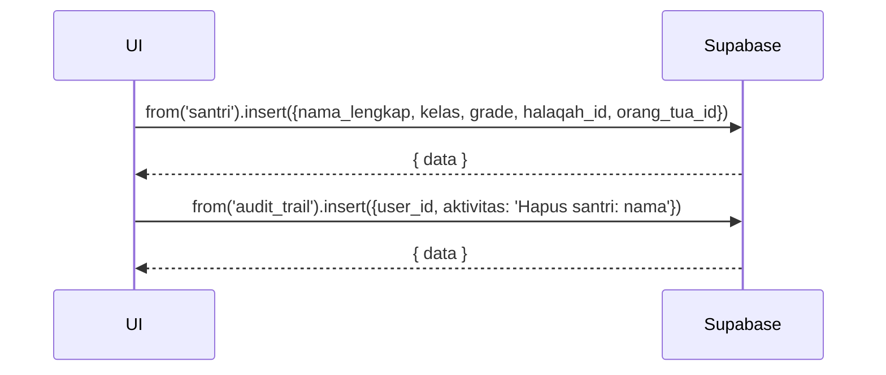

# UC-005 — CRUD Data Santri

Document Version: v1.0
Use Case ID: UC-005
Use Case Name: CRUD Data Santri
File Path: ./sys_uc_005.md
Status: Draft
Actors: Staff TU
Complexity: 🟡 Medium
Tabel Utama: santri, audit_trail

## Purpose

Staff TU mengelola data santri: membuat, melihat, mengedit, dan menghapus data santri serta menghubungkannya ke halaqah dan akun orang tua.

## Preconditions

- Staff TU sudah login.
- Halaqah sudah dibuat sebelumnya.
- Berada di halaman `/tu/data/santri`.

## Main Flow

**Create:**
1. TU menekan "Tambah Santri", mengisi form (nama, kelas, grade, halaqah, orang_tua_id opsional).
2. UI insert ke tabel `santri`.

**Read:**
1. UI mengambil semua santri dengan join ke `halaqah` dan `orang_tua`.
2. Ditampilkan dalam tabel dengan filter halaqah, kelas, grade.

**Update:**
1. TU menekan "Edit", mengubah data, menekan "Simpan".
2. UI update baris di `santri`.

**Delete:**
1. TU menekan "Hapus" → konfirmasi.
2. UI delete baris dari `santri`.
3. Cascade delete otomatis hapus setoran, tikrar, absensi, ukj, uas, akhlaq santri tersebut.
4. Catat ke `audit_trail`.

## Alternate / Error Flows

- Belum ada halaqah → tampilkan "Buat halaqah terlebih dahulu".

## Sequence Diagram



## API Contract (Supabase SDK)

```javascript
// Create
await supabase.from('santri').insert({
  nama_lengkap: 'Ahmad Fauzi',
  kelas: '7A',
  grade: 'tahsin',
  halaqah_id: 'uuid-halaqah',
  orang_tua_id: 'uuid-ortu' // nullable
});

// Read dengan join
const { data } = await supabase
  .from('santri')
  .select(`
    *,
    halaqah(nama_halaqah, grade),
    orang_tua(nama_lengkap)
  `)
  .order('nama_lengkap');

// Update
await supabase.from('santri')
  .update({ kelas: '8A', grade: 'takmil' })
  .eq('id', santriId);

// Delete
await supabase.from('santri').delete().eq('id', santriId);
await supabase.from('audit_trail').insert({
  user_id: currentUser.id,
  aktivitas: `Hapus santri: ${namaSantri}`
});
```

## Data Model

- `santri` — id, nama_lengkap, kelas, grade, halaqah_id, orang_tua_id, created_at
- `halaqah` — id, nama_halaqah, grade, pengampu_id
- `orang_tua` — id, nama_lengkap, nomor_hp
- `audit_trail` — id, user_id, aktivitas, created_at

## Validation Rules

- nama_lengkap: required
- kelas: required
- grade: required, enum (tahsin, takmil, tahfiz)
- halaqah_id: required, harus ada di tabel `halaqah`
- orang_tua_id: opsional, harus ada di tabel `orang_tua` jika diisi

## Security & Permissions

- Hanya role `tu` yang boleh INSERT, UPDATE, DELETE di tabel `santri`.
- Semua role authenticated boleh SELECT `santri` sesuai scope masing-masing.

## Traceability

User Flow: userflow_uc_005.md
SRS: F-17

---


