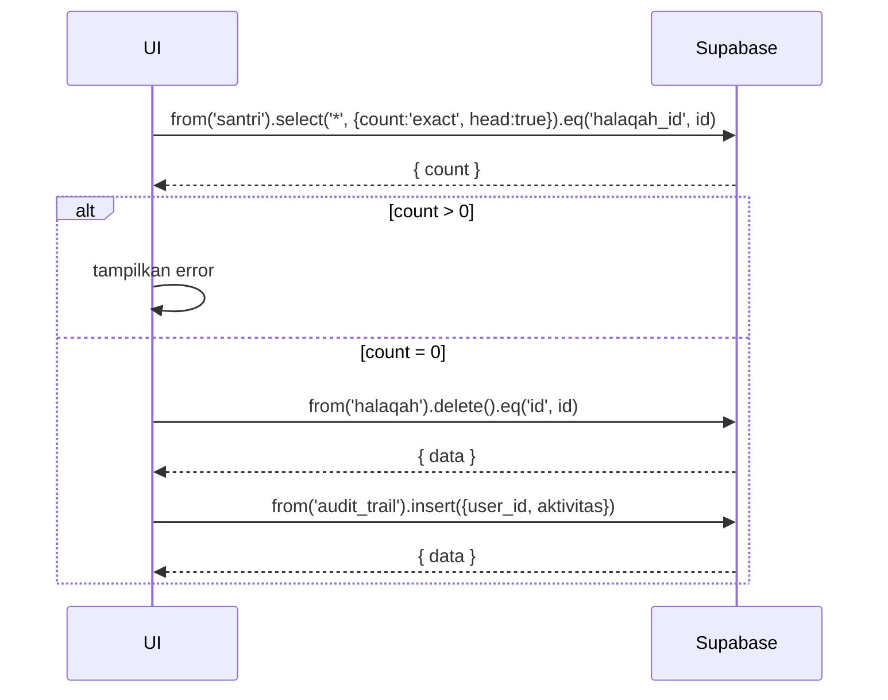

---

# UC-006 — CRUD Halaqah

Document Version: v1.0
Use Case ID: UC-006
Use Case Name: CRUD Halaqah
File Path: ./sys_uc_006.md
Status: Draft
Actors: Staff TU
Complexity: 🟡 Medium
Tabel Utama: halaqah, santri, audit_trail

## Purpose

Staff TU mengelola data halaqah: membuat, melihat, mengedit, dan menghapus halaqah serta menugaskan pengampu penanggung jawab. Halaqah tidak bisa dihapus jika masih memiliki santri aktif.

## Preconditions

- Staff TU sudah login.
- Akun Pengampu sudah dibuat sebelumnya.
- Berada di halaman `/tu/data/halaqah`.

## Main Flow

**Create:**
1. TU menekan "Tambah Halaqah", mengisi form (nama, grade, pengampu_id).
2. UI insert ke tabel `halaqah`.

**Read:**
1. UI mengambil semua halaqah dengan join ke `profiles` (pengampu) dan count santri.
2. Ditampilkan dalam tabel.

**Update:**
1. TU menekan "Edit", mengubah data, menekan "Simpan".
2. UI update baris di `halaqah`.

**Delete:**
1. TU menekan "Hapus" → UI cek jumlah santri di halaqah tersebut.
2. Jika masih ada santri → tampilkan error, batalkan.
3. Jika kosong → UI delete baris, catat ke `audit_trail`.

## Alternate / Error Flows

- Hapus halaqah yang masih punya santri → tampilkan "Halaqah tidak dapat dihapus karena masih memiliki santri aktif".
- Belum ada akun pengampu → tampilkan "Buat akun pengampu terlebih dahulu".

## Sequence Diagram



## API Contract (Supabase SDK)

```javascript
// Create
await supabase.from('halaqah').insert({
  nama_halaqah: 'Halaqah Al-Fatih',
  grade: 'tahfiz',
  pengampu_id: 'uuid-pengampu'
});

// Read dengan join dan count santri
const { data } = await supabase
  .from('halaqah')
  .select(`*, profiles(nama_lengkap), santri(count)`);

// Cek sebelum delete
const { count } = await supabase
  .from('santri')
  .select('*', { count: 'exact', head: true })
  .eq('halaqah_id', halaqahId);

if (count > 0) throw new Error('Halaqah masih memiliki santri aktif');

await supabase.from('halaqah').delete().eq('id', halaqahId);
await supabase.from('audit_trail').insert({
  user_id: currentUser.id,
  aktivitas: `Hapus halaqah: ${namaHalaqah}`
});
```

## Data Model

- `halaqah` — id, nama_halaqah, grade, pengampu_id, created_at
- `profiles` — id, nama_lengkap, role
- `santri` — id, halaqah_id
- `audit_trail` — id, user_id, aktivitas, created_at

## Validation Rules

- nama_halaqah: required
- grade: required, enum (tahsin, takmil, tahfiz)
- pengampu_id: required, harus ada di `profiles` dengan role = pengampu

## Security & Permissions

- Hanya role `tu` yang boleh INSERT, UPDATE, DELETE di tabel `halaqah`.
- Semua role authenticated boleh SELECT `halaqah`.

## Traceability

User Flow: userflow_uc_006.md
SRS: F-17

---
