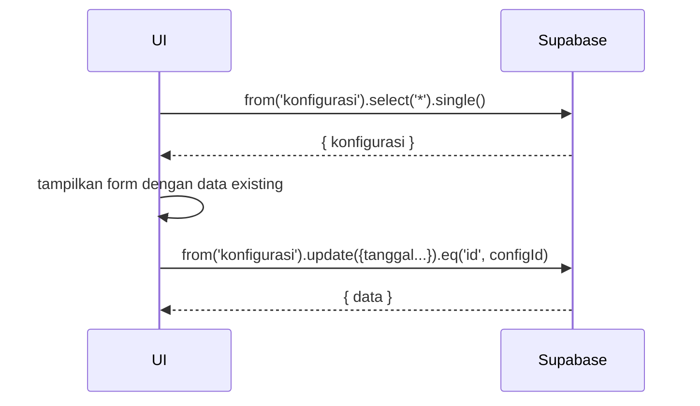

# UC-007 — Konfigurasi Tanggal Semester

Document Version: v1.0
Use Case ID: UC-007
Use Case Name: Konfigurasi Tanggal Semester
File Path: ./sys_uc_007.md
Status: Draft
Actors: Staff TU
Complexity: 🟢 Simple
Tabel Utama: konfigurasi

## Purpose

Staff TU mengatur tanggal mulai dan selesai semester ganjil dan genap. Konfigurasi ini digunakan oleh fitur rekap Excel dan kalkulasi nilai akhir. Tabel `konfigurasi` hanya memiliki satu baris yang selalu di-update.

## Preconditions

- Staff TU sudah login.
- Berada di halaman `/tu/konfigurasi`.

## Main Flow

1. UI mengambil data `konfigurasi` yang sudah ada dan menampilkan form dengan 4 field tanggal.
2. TU mengubah tanggal yang diperlukan.
3. TU menekan "Simpan Konfigurasi".
4. UI validasi tanggal selesai tidak lebih awal dari tanggal mulai.
5. UI update baris tunggal di `konfigurasi`.
6. Tampilkan toast sukses.

## Alternate / Error Flows

- Tanggal selesai lebih awal dari tanggal mulai → tampilkan "Tanggal selesai tidak boleh lebih awal dari tanggal mulai".
- Field tanggal kosong → tampilkan "Tanggal wajib diisi".

## Sequence Diagram



## API Contract (Supabase SDK)

```javascript
// Read existing config
const { data: config } = await supabase
  .from('konfigurasi')
  .select('*')
  .single();

// Update tanggal semester
await supabase.from('konfigurasi')
  .update({
    tanggal_mulai_ganjil: '2025-07-14',
    tanggal_selesai_ganjil: '2025-12-20',
    tanggal_mulai_genap: '2026-01-05',
    tanggal_selesai_genap: '2026-06-20',
    updated_at: new Date().toISOString()
  })
  .eq('id', config.id);
```

## Data Model

- `konfigurasi` — tanggal_mulai_ganjil, tanggal_selesai_ganjil, tanggal_mulai_genap, tanggal_selesai_genap, updated_at

## Validation Rules

- tanggal_mulai_ganjil: required, format date
- tanggal_selesai_ganjil: required, harus >= tanggal_mulai_ganjil
- tanggal_mulai_genap: required, format date
- tanggal_selesai_genap: required, harus >= tanggal_mulai_genap

## Security & Permissions

- Hanya role `tu` yang boleh UPDATE tabel `konfigurasi`.
- Semua role authenticated boleh SELECT.

## Traceability

User Flow: userflow_uc_007.md
SRS: F-17

---
