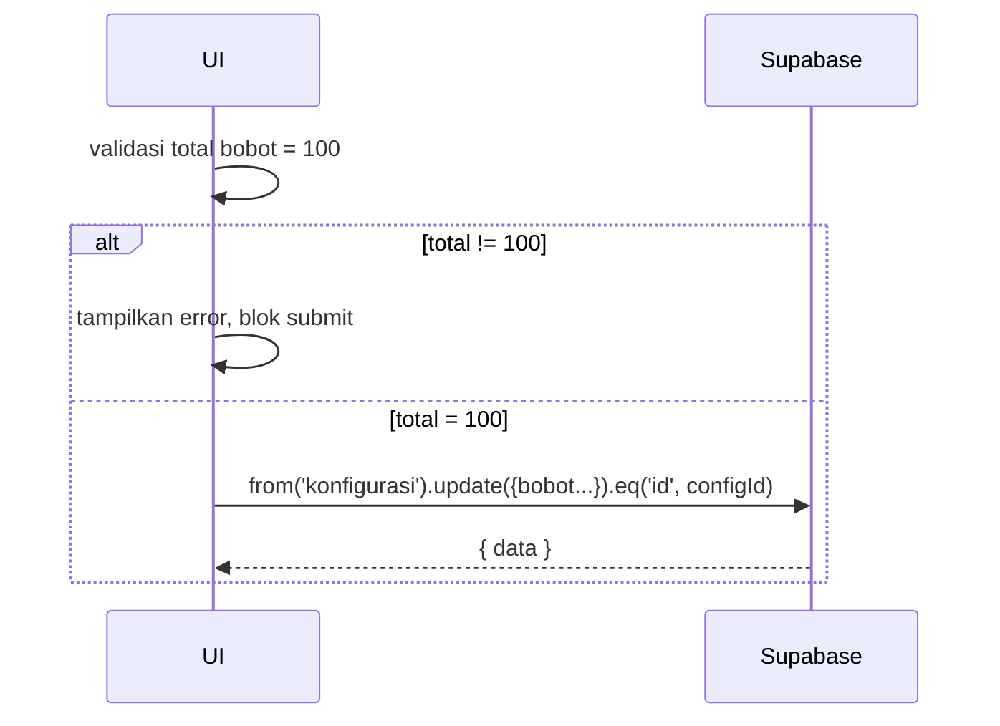

# UC-008 — Konfigurasi Bobot Nilai Akhir

Document Version: v1.0
Use Case ID: UC-008
Use Case Name: Konfigurasi Bobot Nilai Akhir
File Path: ./sys_uc_008.md
Status: Draft
Actors: Staff TU
Complexity: 🟡 Medium
Tabel Utama: konfigurasi

## Purpose

Staff TU mengubah bobot persentase komponen nilai akhir semester. Total seluruh bobot wajib tepat 100% — divalidasi di sisi client sebelum dikirim ke Supabase, dan juga dijaga oleh constraint di database.

## Preconditions

- Staff TU sudah login.
- Berada di halaman `/tu/konfigurasi`.

## Main Flow

1. UI menampilkan form 4 field bobot (setoran, uas, akhlaq, kehadiran) dari data `konfigurasi` existing.
2. TU mengubah bobot lalu menekan "Simpan".
3. UI memvalidasi total bobot = 100 sebelum submit.
4. Jika valid → UI update `konfigurasi`.
5. Tampilkan toast sukses.

## Alternate / Error Flows

- Total bobot ≠ 100 → tampilkan "Total bobot harus 100%", blok submit.
- Field bobot negatif atau kosong → tampilkan "Bobot tidak valid".

## Sequence Diagram



## API Contract (Supabase SDK)

```javascript
// Validasi di client sebelum submit
const total = bobotSetoran + bobotUas + bobotAkhlaq + bobotKehadiran;
if (total !== 100) throw new Error('Total bobot harus 100%');

// Update bobot
await supabase.from('konfigurasi')
  .update({
    bobot_setoran: 40,
    bobot_uas: 40,
    bobot_akhlaq: 10,
    bobot_kehadiran: 10,
    updated_at: new Date().toISOString()
  })
  .eq('id', configId);
```

## Data Model

- `konfigurasi` — bobot_setoran, bobot_uas, bobot_akhlaq, bobot_kehadiran, updated_at

## Validation Rules

- bobot_setoran: required, integer >= 0
- bobot_uas: required, integer >= 0
- bobot_akhlaq: required, integer >= 0
- bobot_kehadiran: required, integer >= 0
- total keempat bobot harus tepat = 100

## Security & Permissions

- Hanya role `tu` yang boleh UPDATE tabel `konfigurasi`.
- Database constraint `bobot_total_100` menjadi safety net jika validasi client dilewati.

## Traceability

User Flow: userflow_uc_008.md
SRS: F-12, F-17

---
