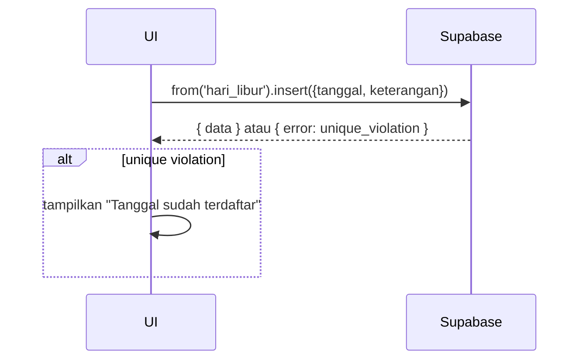

# UC-009 — Konfigurasi Hari Libur

Document Version: v1.0
Use Case ID: UC-009
Use Case Name: Konfigurasi Hari Libur
File Path: ./sys_uc_009.md
Status: Draft
Actors: Staff TU
Complexity: 🟢 Simple
Tabel Utama: hari_libur

## Purpose

Staff TU menambah dan menghapus hari libur. Tanggal yang terdaftar tidak akan dihitung sebagai hari kerja efektif dalam rekap semester dan kalkulasi nilai kehadiran.

## Preconditions

- Staff TU sudah login.
- Berada di halaman `/tu/konfigurasi`.

## Main Flow

**Tambah:**
1. TU menekan "Tambah Hari Libur", mengisi tanggal dan keterangan.
2. UI insert ke `hari_libur`.
3. Jika tanggal sudah ada → Supabase unique constraint error, tampilkan pesan.

**Hapus:**
1. TU menekan "Hapus" pada hari libur yang dipilih → konfirmasi.
2. UI delete baris dari `hari_libur`.

## Alternate / Error Flows

- Tanggal sudah terdaftar → tampilkan "Tanggal ini sudah terdaftar sebagai hari libur".
- Field tanggal kosong → tampilkan "Tanggal wajib diisi".

## Sequence Diagram



## API Contract (Supabase SDK)

```javascript
// Tambah hari libur
const { error } = await supabase.from('hari_libur').insert({
  tanggal: '2025-08-17',
  keterangan: 'Hari Kemerdekaan RI'
});
if (error?.code === '23505') throw new Error('Tanggal sudah terdaftar');

// Hapus hari libur
await supabase.from('hari_libur').delete().eq('id', hariLiburId);

// Read semua
const { data } = await supabase
  .from('hari_libur')
  .select('*')
  .order('tanggal');
```

## Data Model

- `hari_libur` — id, tanggal, keterangan, created_at

## Validation Rules

- tanggal: required, format date, unique
- keterangan: required

## Security & Permissions

- Hanya role `tu` yang boleh INSERT dan DELETE di `hari_libur`.
- Semua role authenticated boleh SELECT.

## Traceability

User Flow: userflow_uc_009.md
SRS: F-17

---
