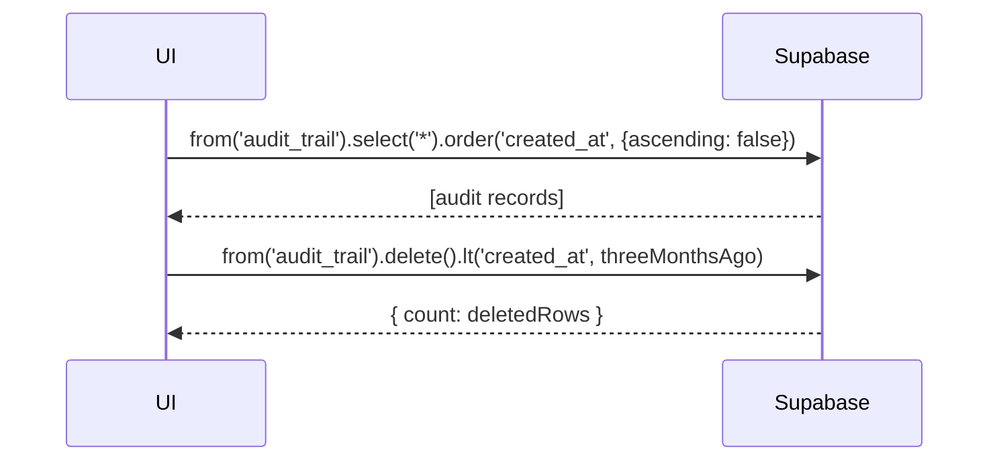

# UC-010 — Kelola Audit Trail

Document Version: v1.0
Use Case ID: UC-010
Use Case Name: Kelola Audit Trail
File Path: ./sys_uc_010.md
Status: Draft
Actors: Staff TU
Complexity: 🟡 Medium
Tabel Utama: audit_trail

## Purpose

Staff TU melihat riwayat aktivitas kritis sistem dan dapat memicu penghapusan manual data audit trail yang berusia lebih dari 3 bulan. Auto-delete juga berjalan otomatis via Supabase scheduled function (pg_cron) setiap hari.

## Preconditions

- Staff TU sudah login.
- Berada di halaman `/tu/sistem/audit`.

## Main Flow

**Lihat:**
1. UI mengambil data `audit_trail` dengan filter opsional tanggal, jenis aktivitas.
2. Ditampilkan dalam tabel urut terbaru di atas.

**Hapus Manual:**
1. TU menekan "Hapus Data Lama" → konfirmasi.
2. UI delete semua row `audit_trail` dengan `created_at < NOW() - 3 bulan`.
3. Tampilkan toast sukses atau "Tidak ada data lama".

**Auto-delete:**
- Supabase pg_cron menjalankan fungsi `delete_old_audit_trail()` setiap hari secara otomatis.

## Alternate / Error Flows

- Tidak ada data lama → tampilkan "Tidak ada data lama yang perlu dihapus".
- Gagal memuat data → tampilkan error state dengan tombol "Coba Lagi".

## Sequence Diagram



## API Contract (Supabase SDK)

```javascript
// Read audit trail
const { data } = await supabase
  .from('audit_trail')
  .select('*')
  .order('created_at', { ascending: false });

// Hapus manual data lama
const threeMonthsAgo = new Date();
threeMonthsAgo.setMonth(threeMonthsAgo.getMonth() - 3);

const { count, error } = await supabase
  .from('audit_trail')
  .delete()
  .lt('created_at', threeMonthsAgo.toISOString());

if (count === 0) showMessage('Tidak ada data lama yang perlu dihapus');
```

## Data Model

- `audit_trail` — id, user_id, aktivitas, created_at

## Validation Rules

- Tidak ada input user — hanya filter tampilan dan konfirmasi hapus.

## Security & Permissions

- Hanya role `tu` yang boleh SELECT dan DELETE di `audit_trail`.
- Tidak ada role lain yang boleh akses tabel ini sama sekali.

## Traceability

User Flow: userflow_uc_010.md
SRS: F-16

---

