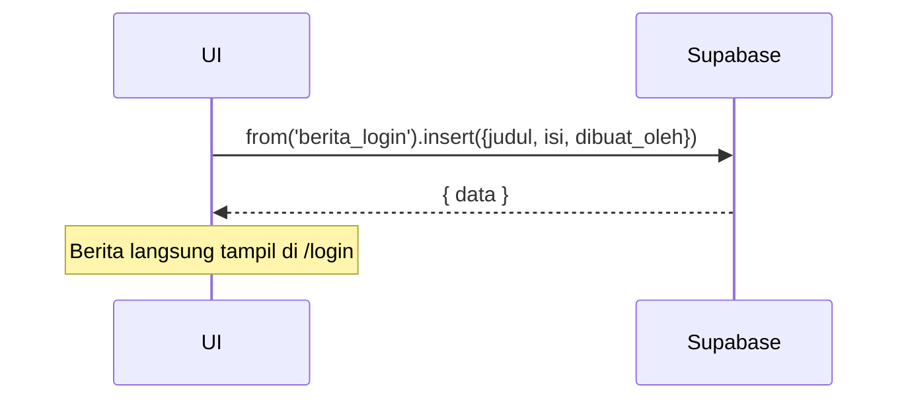

---

# UC-011 — Kelola Berita Halaman Login

Document Version: v1.0
Use Case ID: UC-011
Use Case Name: Kelola Berita Halaman Login
File Path: ./sys_uc_011.md
Status: Draft
Actors: Staff TU
Complexity: 🟢 Simple
Tabel Utama: berita_login

## Purpose

Staff TU membuat, mengedit, dan menghapus berita yang ditampilkan di halaman login. Berita bersifat publik (dapat dilihat tanpa login) dan hanya format teks tanpa gambar.

## Preconditions

- Staff TU sudah login.
- Berada di halaman `/tu/sistem/berita`.

## Main Flow

**Create:**
1. TU menekan "Tambah Berita", mengisi judul dan isi.
2. UI insert ke `berita_login` dengan `dibuat_oleh = currentUser.id`.
3. Berita langsung tampil di halaman `/login`.

**Update:**
1. TU menekan "Edit" pada berita yang dipilih.
2. Mengubah konten lalu menekan "Simpan".
3. UI update baris di `berita_login`.

**Delete:**
1. TU menekan "Hapus" → konfirmasi.
2. UI delete baris dari `berita_login`.
3. Berita tidak lagi tampil di halaman login.

## Alternate / Error Flows

- Field judul atau isi kosong → tampilkan "Field ini wajib diisi".
- TU menekan "Batal" → modal tertutup, tidak ada perubahan.

## Sequence Diagram



## API Contract (Supabase SDK)

```javascript
// Create
await supabase.from('berita_login').insert({
  judul: 'Informasi Pekan Murajaah',
  isi: 'Isi berita teks saja...',
  dibuat_oleh: currentUser.id
});

// Update
await supabase.from('berita_login')
  .update({
    judul: 'Judul Baru',
    isi: 'Isi baru...',
    updated_at: new Date().toISOString()
  })
  .eq('id', beritaId);

// Delete
await supabase.from('berita_login').delete().eq('id', beritaId);

// Read publik (tanpa auth) — dipanggil di halaman /login
const { data } = await supabase
  .from('berita_login')
  .select('judul, isi, created_at')
  .order('created_at', { ascending: false });
```

## Data Model

- `berita_login` — id, judul, isi, dibuat_oleh, created_at, updated_at

## Validation Rules

- judul: required
- isi: required, teks saja (no HTML/markdown/gambar)

## Security & Permissions

- Hanya role `tu` yang boleh INSERT, UPDATE, DELETE di `berita_login`.
- SELECT terbuka untuk semua termasuk `anon` (unauthenticated) karena berita tampil di halaman login publik.
- RLS policy: tambahkan policy untuk `anon` role boleh SELECT.

## Traceability

User Flow: userflow_uc_011.md
SRS: F-15

---
