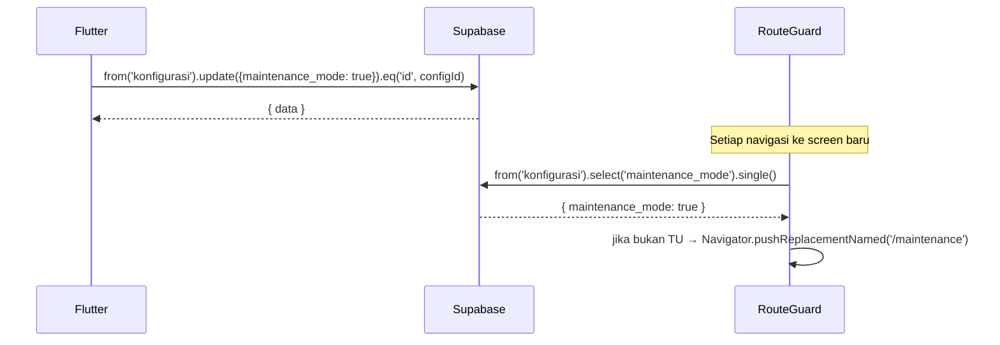

# UC-012 — Aktifkan/Nonaktifkan Maintenance Mode

Document Version: v1.0
Use Case ID: UC-012
Use Case Name: Aktifkan/Nonaktifkan Maintenance Mode
File Path: ./sys_uc_012.md
Status: Draft
Actors: Staff TU
Complexity: 🟡 Medium
Tabel Utama: konfigurasi

## Purpose

Staff TU mengaktifkan atau menonaktifkan maintenance mode. Saat aktif, semua role selain TU diarahkan ke screen `/maintenance` oleh route guard di Flutter dan tidak dapat mengakses fitur apapun.

## Preconditions

- Staff TU sudah login.
- Berada di screen `/tu/konfigurasi`.

## Main Flow

**Aktifkan:**
1. TU menekan toggle "Maintenance Mode" → konfirmasi muncul.
2. TU menekan "Ya, Aktifkan".
3. UI update `konfigurasi.maintenance_mode = true`.
4. Route guard Flutter mulai mengarahkan semua non-TU ke `/maintenance` pada navigasi berikutnya.

**Nonaktifkan:**
1. TU menekan toggle yang sedang aktif → konfirmasi muncul.
2. TU menekan "Ya, Nonaktifkan".
3. UI update `konfigurasi.maintenance_mode = false`.
4. Semua pengguna dapat kembali mengakses sistem.

## Alternate / Error Flows

- TU menekan "Batal" → toggle kembali ke posisi semula, tidak ada perubahan.
- Koneksi gagal saat update → toggle kembali ke posisi semula, tampilkan error.

## Sequence Diagram



## API Contract (Supabase SDK)

```dart
// Toggle maintenance mode (dari Flutter UI)
await Supabase.instance.client
    .from('konfigurasi')
    .update({
      'maintenance_mode': true,
      'updated_at': DateTime.now().toIso8601String(),
    })
    .eq('id', configId);

// Route Guard Flutter — cek setiap kali navigasi
// Implementasi di GoRouter redirect atau MaterialApp onGenerateRoute
final config = await Supabase.instance.client
    .from('konfigurasi')
    .select('maintenance_mode')
    .single();

if (config['maintenance_mode'] == true && userRole != 'tu') {
  Navigator.pushReplacementNamed(context, '/maintenance');
}
```

## Data Model

- `konfigurasi` — maintenance_mode, updated_at

## Validation Rules

- maintenance_mode: boolean

## Security & Permissions

- Hanya role `tu` yang boleh UPDATE `konfigurasi`.
- Route guard membaca `konfigurasi` menggunakan session user yang sedang login — RLS memastikan semua authenticated user boleh SELECT.
- Role `tu` dikecualikan dari pemeriksaan maintenance di route guard untuk menghindari infinite redirect.

## Traceability

User Flow: userflow_uc_012.md
SRS: F-17