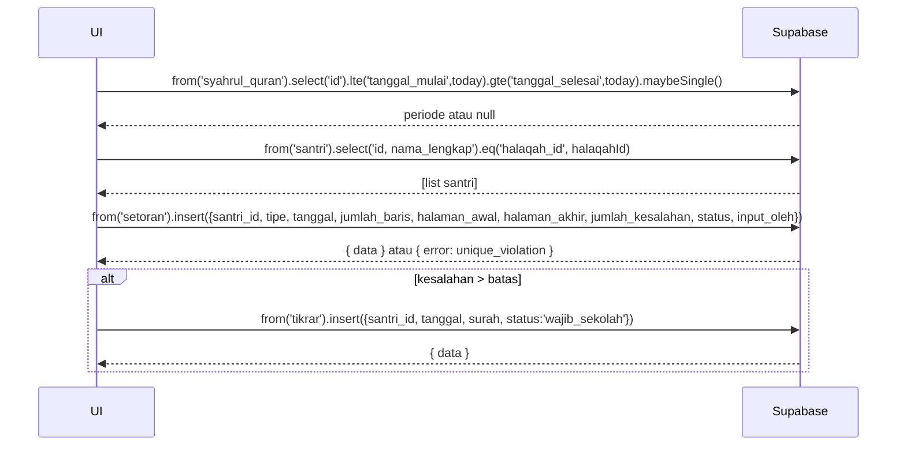

# UC-013 — Input Setoran Sabak & Sabki

Document Version: v1.0
Use Case ID: UC-013
Use Case Name: Input Setoran Sabak & Sabki
File Path: ./sys_uc_013.md
Status: Draft
Actors: Pengampu
Complexity: 🔴 Complex
Tabel Utama: setoran, tikrar, syahrul_quran

## Purpose

Pengampu menginput setoran harian Sabak dan Sabki untuk santri di halaqahnya. Sistem otomatis membuat record Tikrar jika jumlah kesalahan melebihi batas. Kolom Sabki disembunyikan sepenuhnya saat periode Syahrul Quran aktif.

## Preconditions

- Pengampu sudah login.
- Berada di halaman `/pengampu/setoran`.
- Sudah ada santri di halaqah pengampu.

## Main Flow

1. UI cek apakah periode Syahrul Quran aktif hari ini.
2. UI mengambil daftar santri halaqah pengampu.
3. Pengampu memilih tanggal setoran (default hari ini, bisa diubah ke tanggal lain).
4. Pengampu menekan nama santri → modal input muncul.
5. Jika Syahrul Quran aktif: hanya tampilkan field Sabak saja.
6. Jika tidak aktif: tampilkan field Sabak dan Sabki.
7. Pengampu mengisi field (jumlah_baris, halaman_awal, halaman_akhir, jumlah_kesalahan).
8. Pengampu menekan "Simpan".
9. UI cek duplikasi: apakah sudah ada setoran tipe + santri + tanggal yang sama.
10. Jika duplikat → tampilkan error "Setoran sudah ada, silakan edit".
11. Jika tidak duplikat → UI insert ke `setoran`.
12. Jika `jumlah_kesalahan` melebihi batas (2 kesalahan per halaman) → UI otomatis insert ke `tikrar` dengan status `wajib_sekolah`.
13. Tampilkan toast sukses.

**Edit Setoran:**
1. Pengampu memilih tanggal yang sudah ada setorannya → nama santri yang sudah diinput ditandai.
2. Pengampu menekan nama santri → modal muncul dengan data existing.
3. Mengubah data → UI update baris di `setoran`.

## Alternate / Error Flows

- Duplikasi setoran → tampilkan "Setoran sudah ada untuk santri ini pada tanggal ini, silakan edit".
- Field wajib kosong → tampilkan error per field.
- Syahrul Quran aktif → kolom Sabki tidak muncul sama sekali di modal, bukan hanya disabled.
- Koneksi gagal saat insert Tikrar → setoran tetap tersimpan, Tikrar tidak terbuat — tampilkan warning.

## Sequence Diagram



## API Contract (Supabase SDK)

```javascript
// Cek Syahrul Quran aktif
const today = new Date().toISOString().split('T')[0];
const { data: syahrul } = await supabase
  .from('syahrul_quran')
  .select('id')
  .lte('tanggal_mulai', today)
  .gte('tanggal_selesai', today)
  .maybeSingle();
const isSyahrulQuran = !!syahrul;

// Hitung status dan batas kesalahan
const totalHalaman = halamanAkhir - halamanAwal + 1;
const batasKesalahan = totalHalaman * 2; // 2 kesalahan per halaman
const status = jumlahKesalahan > batasKesalahan ? 'mengulang' : 'lulus';

// Insert setoran
const { error } = await supabase.from('setoran').insert({
  santri_id: santriId,
  tipe: 'sabak', // atau 'sabki'
  tanggal: selectedDate,
  jumlah_baris: jumlahBaris,
  halaman_awal: halamanAwal,
  halaman_akhir: halamanAkhir,
  jumlah_kesalahan: jumlahKesalahan,
  status: status,
  input_oleh: currentUser.id
});
if (error?.code === '23505') throw new Error('Setoran sudah ada');

// Auto-create Tikrar jika melebihi batas
if (status === 'mengulang') {
  await supabase.from('tikrar').insert({
    santri_id: santriId,
    tanggal: selectedDate,
    surah: `Hal. ${halamanAwal}-${halamanAkhir}`,
    status: 'wajib_sekolah'
  });
}

// Edit setoran existing
await supabase.from('setoran')
  .update({
    jumlah_baris: jumlahBaris,
    halaman_awal: halamanAwal,
    halaman_akhir: halamanAkhir,
    jumlah_kesalahan: jumlahKesalahan,
    status: status,
    updated_at: new Date().toISOString()
  })
  .eq('id', setoranId);
```

## Data Model

- `setoran` — id, santri_id, tipe, tanggal, jumlah_baris, halaman_awal, halaman_akhir, jumlah_kesalahan, status, input_oleh, created_at, updated_at
- `tikrar` — id, santri_id, tanggal, surah, status, created_at
- `syahrul_quran` — id, tanggal_mulai, tanggal_selesai

## Validation Rules

- santri_id: required, harus santri di halaqah pengampu yang login
- tipe: required, enum (sabak, sabki) — manzil tidak boleh diinput di sini
- tanggal: required, format date
- jumlah_baris: required, integer > 0
- halaman_awal: required, integer > 0
- halaman_akhir: required, integer >= halaman_awal
- jumlah_kesalahan: required, integer >= 0
- Kombinasi santri_id + tipe + tanggal harus unik

## Security & Permissions

- RLS `setoran`: pengampu hanya boleh INSERT/UPDATE setoran untuk santri di halaqahnya sendiri.
- RLS `setoran`: SELECT untuk pengampu dibatasi hanya santri halaqah miliknya.
- RLS `tikrar`: pengampu hanya boleh INSERT untuk santri di halaqahnya.
- Orang tua tidak boleh INSERT tipe sabak atau sabki.

## Traceability

User Flow: userflow_uc_013.md
SRS: F-02, F-04

---
