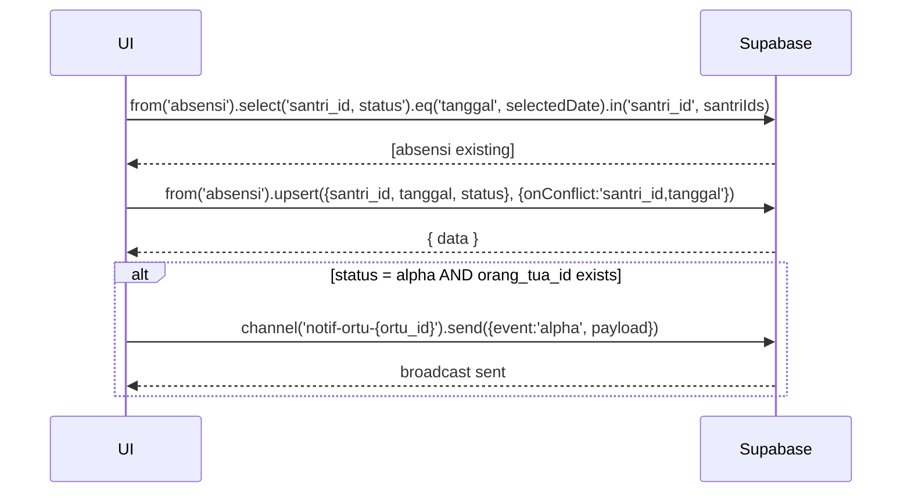

# UC-014 — Input Absensi Santri

Document Version: v1.0
Use Case ID: UC-014
Use Case Name: Input Absensi Santri
File Path: ./sys_uc_014.md
Status: Draft
Actors: Pengampu
Complexity: 🟡 Medium
Tabel Utama: absensi

## Purpose

Pengampu mencatat ketidakhadiran santri dengan model exception-based: tidak adanya record berarti santri hadir. Sistem tidak menyimpan record hadir. Hanya status Alpha yang memicu notifikasi realtime ke akun Orang Tua.

## Preconditions

- Pengampu sudah login.
- Berada di halaman `/pengampu/absensi`.
- Sudah ada santri di halaqah pengampu.

## Main Flow

1. UI menampilkan daftar santri halaqah — semua dianggap hadir secara default.
2. Pengampu memilih tanggal (default hari ini, bisa diubah).
3. UI mengambil record absensi yang sudah ada untuk tanggal tersebut dan menandai santri yang tidak hadir.
4. Pengampu menekan nama santri yang tidak hadir → muncul pilihan status: Alpha, Sakit, atau Izin.
5. UI upsert record ke `absensi`.
6. Jika status = Alpha dan santri punya `orang_tua_id`:
   - UI kirim notifikasi realtime ke channel orang tua via Supabase Realtime.
7. Kegagalan notifikasi tidak membatalkan penyimpanan absensi.
8. Tampilkan toast sukses.

**Ubah/Hapus Absensi:**
1. Pengampu menekan kembali santri yang sudah ditandai.
2. Muncul pilihan: ubah status atau hapus (kembalikan ke hadir).
3. UI update atau delete baris di `absensi`.

## Alternate / Error Flows

- Santri tidak punya akun Orang Tua → absensi tetap tersimpan, notifikasi dilewati tanpa error.
- Koneksi gagal → tampilkan error state dengan tombol "Coba Lagi".

## Sequence Diagram



## API Contract (Supabase SDK)

```javascript
// Ambil absensi existing untuk tanggal terpilih
const { data: absensiExisting } = await supabase
  .from('absensi')
  .select('santri_id, status')
  .eq('tanggal', selectedDate)
  .in('santri_id', santriIds);

// Upsert absensi
const { error } = await supabase.from('absensi').upsert({
  santri_id: santriId,
  tanggal: selectedDate,
  status: 'alpha' // atau 'sakit', 'izin'
}, { onConflict: 'santri_id,tanggal' });

// Kirim notifikasi realtime jika Alpha
if (status === 'alpha' && santri.orang_tua_id) {
  await supabase
    .channel(`notif-ortu-${santri.orang_tua_id}`)
    .send({
      type: 'broadcast',
      event: 'alpha_notification',
      payload: {
        santri_nama: santri.nama_lengkap,
        tanggal: selectedDate
      }
    });
}

// Hapus absensi (kembalikan ke hadir)
await supabase.from('absensi')
  .delete()
  .eq('santri_id', santriId)
  .eq('tanggal', selectedDate);
```

## Data Model

- `absensi` — id, santri_id, tanggal, status, created_at
- `santri` — id, nama_lengkap, orang_tua_id, halaqah_id

## Validation Rules

- santri_id: required, harus santri di halaqah pengampu yang login
- tanggal: required, format date
- status: required, enum (alpha, sakit, izin)
- Kombinasi santri_id + tanggal harus unik
- Sistem tidak boleh menyimpan record dengan status hadir

## Security & Permissions

- RLS `absensi`: pengampu hanya boleh INSERT/UPDATE/DELETE untuk santri di halaqahnya.
- RLS `absensi`: orang tua hanya boleh SELECT absensi anak mereka.
- RLS `absensi`: koordinator dan kepsek boleh SELECT semua.

## Traceability

User Flow: userflow_uc_014.md
SRS: F-07

---
