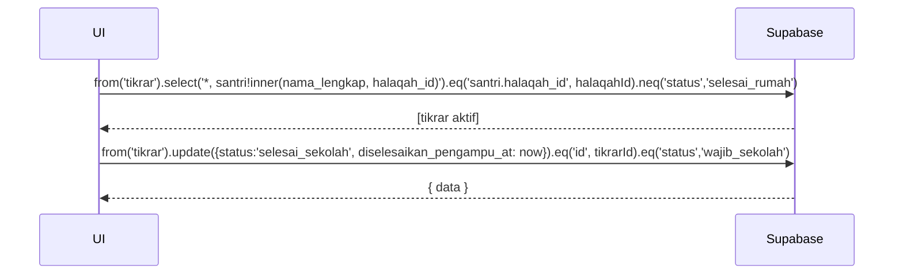

# UC-015 — Kelola Tikrar di Sekolah

Document Version: v1.0
Use Case ID: UC-015
Use Case Name: Kelola Tikrar di Sekolah
File Path: ./sys_uc_015.md
Status: Draft
Actors: Pengampu
Complexity: 🟡 Medium
Tabel Utama: tikrar

## Purpose

Pengampu melihat daftar Tikrar aktif santri halaqahnya dan mengelola status Tikrar di sekolah: menandai selesai di sekolah atau mengalihkan ke rumah. Perpindahan status hanya boleh linear satu arah dan dijaga dengan guard query.

## Preconditions

- Pengampu sudah login.
- Berada di halaman `/pengampu/tikrar`.
- Sudah ada record Tikrar dengan status `wajib_sekolah` atau `selesai_sekolah`.

## Main Flow

**Tandai Selesai di Sekolah:**
1. UI menampilkan daftar Tikrar aktif seluruh santri halaqah beserta statusnya.
2. Pengampu menekan "Selesai di Sekolah" pada Tikrar berstatus `wajib_sekolah`.
3. Konfirmasi muncul → Pengampu menekan "Ya".
4. UI update status menjadi `selesai_sekolah` dan isi `diselesaikan_pengampu_at`.
5. Tampilkan toast sukses.

**Alihkan ke Rumah:**
1. Pengampu menekan "Alihkan ke Rumah" pada Tikrar berstatus `selesai_sekolah`.
2. Konfirmasi muncul → Pengampu menekan "Ya".
3. UI update status menjadi `wajib_rumah` dan isi `dialihkan_rumah_at`.
4. Tikrar muncul di akun Orang Tua untuk divalidasi.

## Alternate / Error Flows

- Tombol aksi hanya muncul sesuai status saat ini — tidak ada tombol yang bisa membuat status melompat atau mundur.
- Koneksi gagal → tampilkan error state dengan tombol "Coba Lagi".

## Sequence Diagram



## API Contract (Supabase SDK)

```javascript
// Ambil tikrar aktif halaqah pengampu
const { data: tikrarList } = await supabase
  .from('tikrar')
  .select(`*, santri!inner(nama_lengkap, halaqah_id)`)
  .eq('santri.halaqah_id', halaqahId)
  .neq('status', 'selesai_rumah')
  .order('created_at', { ascending: false });

// Tandai selesai di sekolah
await supabase.from('tikrar')
  .update({
    status: 'selesai_sekolah',
    diselesaikan_pengampu_at: new Date().toISOString()
  })
  .eq('id', tikrarId)
  .eq('status', 'wajib_sekolah'); // Guard — hanya update jika status benar

// Alihkan ke rumah
await supabase.from('tikrar')
  .update({
    status: 'wajib_rumah',
    dialihkan_rumah_at: new Date().toISOString()
  })
  .eq('id', tikrarId)
  .eq('status', 'selesai_sekolah'); // Guard
```

## Data Model

- `tikrar` — id, santri_id, tanggal, surah, status, diselesaikan_pengampu_at, dialihkan_rumah_at, diselesaikan_ortu_at, created_at

## Validation Rules

- Perpindahan status hanya boleh: `wajib_sekolah` → `selesai_sekolah` → `wajib_rumah` → `selesai_rumah`.
- Guard `.eq('status', currentStatus)` wajib ada di setiap query update untuk mencegah race condition.

## Security & Permissions

- RLS `tikrar`: pengampu hanya boleh UPDATE tikrar untuk santri di halaqahnya.
- RLS `tikrar`: pengampu hanya boleh set status ke `selesai_sekolah` atau `wajib_rumah`.
- RLS `tikrar`: orang tua hanya boleh UPDATE tikrar anak mereka dan hanya boleh set status ke `selesai_rumah`.

## Traceability

User Flow: userflow_uc_015.md
SRS: F-04

---
