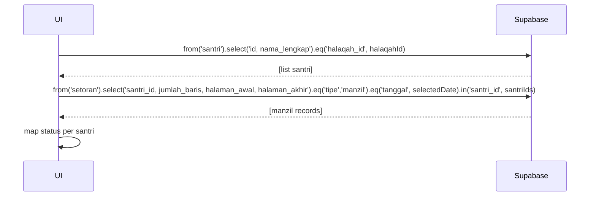

# UC-016 — Lihat Status Manzil Santri

Document Version: v1.0
Use Case ID: UC-016
Use Case Name: Lihat Status Manzil Santri
File Path: ./sys_uc_016.md
Status: Draft
Actors: Pengampu
Complexity: 🟢 Simple
Tabel Utama: setoran

## Purpose

Pengampu melihat status Manzil seluruh santri halaqahnya pada tanggal tertentu. Ini adalah tampilan read-only — pengampu tidak bisa input atau ubah data Manzil. Ditampilkan bersama Tikrar di halaman `/pengampu/tikrar`.

## Preconditions

- Pengampu sudah login.
- Berada di halaman `/pengampu/tikrar`.

## Main Flow

1. UI mengambil ID seluruh santri halaqah pengampu.
2. UI mengambil setoran tipe `manzil` untuk santri-santri tersebut pada tanggal yang dipilih.
3. UI menampilkan daftar santri dengan kolom status: sudah Manzil (✓) atau belum (—).
4. Pengampu dapat filter berdasarkan tanggal.

## Alternate / Error Flows

- Belum ada santri yang input Manzil pada tanggal tersebut → tampilkan empty state "Belum ada setoran Manzil".

## Sequence Diagram



## API Contract (Supabase SDK)

```javascript
// Ambil ID santri halaqah
const { data: santriList } = await supabase
  .from('santri')
  .select('id, nama_lengkap')
  .eq('halaqah_id', halaqahId);

const santriIds = santriList.map(s => s.id);

// Ambil status Manzil untuk tanggal terpilih
const { data: manzilData } = await supabase
  .from('setoran')
  .select('santri_id, jumlah_baris, halaman_awal, halaman_akhir')
  .eq('tipe', 'manzil')
  .eq('tanggal', selectedDate)
  .in('santri_id', santriIds);

// Map per santri
const manzilMap = Object.fromEntries(
  manzilData.map(m => [m.santri_id, m])
);
// santri yang ID-nya ada di manzilMap → sudah Manzil
// santri yang tidak ada → belum Manzil
```

## Data Model

- `setoran` — santri_id, tipe, tanggal, jumlah_baris, halaman_awal, halaman_akhir
- `santri` — id, nama_lengkap, halaqah_id

## Validation Rules

Tidak ada — ini hanya read-only view.

## Security & Permissions

- RLS `setoran`: pengampu boleh SELECT setoran tipe manzil untuk santri di halaqahnya.
- Pengampu tidak boleh INSERT, UPDATE, DELETE tipe manzil.

## Traceability

User Flow: userflow_uc_016.md
SRS: F-03

---
