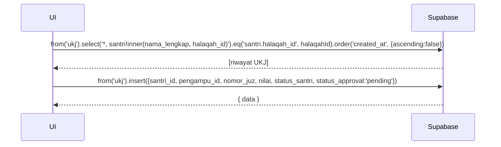

# UC-017 — Input Hasil UKJ

Document Version: v1.0
Use Case ID: UC-017
Use Case Name: Input Hasil UKJ
File Path: ./sys_uc_017.md
Status: Draft
Actors: Pengampu
Complexity: 🟡 Medium
Tabel Utama: ukj, audit_trail

## Purpose

Pengampu menginput hasil Ujian Kenaikan Juz (UKJ) untuk santri. Setiap UKJ yang diinput berstatus `pending` hingga disetujui koordinator. UKJ yang sudah `approved` tidak dapat diubah pengampu. Record UKJ yang ditolak tetap tersimpan sebagai riwayat.

## Preconditions

- Pengampu sudah login.
- Berada di halaman `/pengampu/ukj`.
- Santri telah melaksanakan ujian kenaikan juz.

## Main Flow

1. UI menampilkan daftar riwayat UKJ santri halaqah dengan status approval masing-masing.
2. Pengampu menekan "Input UKJ".
3. Modal muncul dengan form: pilih santri, nomor juz, nilai (0-100), status santri (lulus/mengulang).
4. Pengampu mengisi form lalu menekan "Simpan".
5. UI insert ke `ukj` dengan `status_approval = 'pending'`.
6. Tampilkan toast "Hasil UKJ berhasil diinput, menunggu persetujuan koordinator".

**Edit UKJ (hanya jika masih pending):**
1. Pengampu menekan "Edit" pada UKJ berstatus `pending`.
2. Modal muncul dengan data existing.
3. Pengampu mengubah data → UI update baris di `ukj`.

## Alternate / Error Flows

- Nilai di luar 0-100 → tampilkan "Nilai harus antara 0 dan 100".
- Nomor juz di luar 1-30 → tampilkan "Nomor juz tidak valid".
- UKJ sudah `approved` → tombol edit tidak muncul sama sekali.
- Field wajib kosong → tampilkan error per field.

## Sequence Diagram



## API Contract (Supabase SDK)

```javascript
// Read riwayat UKJ halaqah
const { data: ukjList } = await supabase
  .from('ukj')
  .select(`
    *,
    santri!inner(nama_lengkap, halaqah_id)
  `)
  .eq('santri.halaqah_id', halaqahId)
  .order('created_at', { ascending: false });

// Insert UKJ baru
await supabase.from('ukj').insert({
  santri_id: santriId,
  pengampu_id: currentUser.id,
  nomor_juz: 5,
  nilai: 85,
  status_santri: 'lulus',
  status_approval: 'pending'
});

// Update UKJ yang masih pending
await supabase.from('ukj')
  .update({
    nomor_juz: nomorJuz,
    nilai: nilai,
    status_santri: statusSantri
  })
  .eq('id', ukjId)
  .eq('status_approval', 'pending'); // Guard — hanya update jika masih pending
```

## Data Model

- `ukj` — id, santri_id, pengampu_id, nomor_juz, nilai, status_santri, status_approval, alasan_penolakan, approved_by, approved_at, created_at

## Validation Rules

- santri_id: required, harus santri di halaqah pengampu yang login
- nomor_juz: required, integer 1-30
- nilai: required, integer 0-100
- status_santri: required, enum (lulus, mengulang)
- Guard `.eq('status_approval', 'pending')` wajib ada saat update

## Security & Permissions

- RLS `ukj`: pengampu hanya boleh INSERT untuk santri halaqahnya.
- RLS `ukj`: pengampu hanya boleh UPDATE jika `status_approval = 'pending'`.
- RLS `ukj`: pengampu tidak boleh UPDATE kolom `status_approval`, `approved_by`, `approved_at`, `alasan_penolakan`.
- Hanya koordinator yang boleh UPDATE kolom-kolom approval.

## Traceability

User Flow: userflow_uc_017.md
SRS: F-05

---

