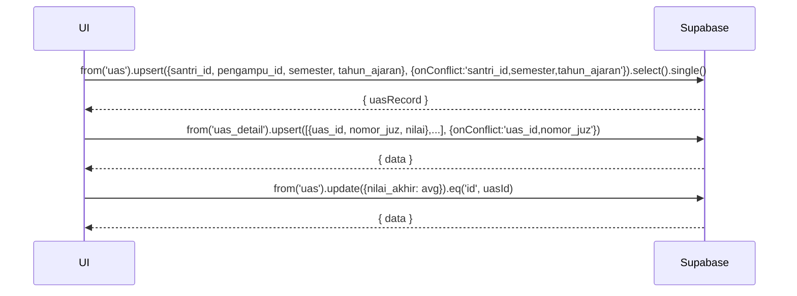

---

# UC-018 — Input Nilai UAS Per Juz

Document Version: v1.0
Use Case ID: UC-018
Use Case Name: Input Nilai UAS Per Juz
File Path: ./sys_uc_018.md
Status: Draft
Actors: Pengampu
Complexity: 🔴 Complex
Tabel Utama: uas, uas_detail

## Purpose

Pengampu menginput nilai Ujian Akhir Semester per juz untuk tiap santri. Jumlah juz yang diujikan dikonfigurasi per santri. Nilai akhir UAS dihitung otomatis sebagai rata-rata dari seluruh juz yang diinput. Tidak memerlukan approval koordinator.

## Preconditions

- Pengampu sudah login.
- Berada di halaman `/pengampu/uas`.
- Konfigurasi tanggal semester sudah diisi TU.

## Main Flow

1. UI menampilkan daftar santri halaqah beserta status UAS semester ini (sudah diinput/belum/belum lengkap).
2. Pengampu menekan "Input UAS" pada santri yang dipilih.
3. Modal muncul dengan pilihan juz yang akan diujikan.
4. Sistem menentukan jumlah juz:
   - Jika hafalan santri > jumlah juz yang dikonfigurasi → pengampu pilih maksimal sejumlah konfigurasi (default 3 juz).
   - Jika hafalan santri ≤ jumlah juz yang dikonfigurasi → seluruh hafalan otomatis dipilih.
5. Pengampu mengisi nilai per juz (0-100).
6. Pengampu menekan "Simpan".
7. UI upsert header ke `uas`.
8. UI upsert detail ke `uas_detail` per juz.
9. Jika semua juz sudah terisi → UI hitung `nilai_akhir = rata-rata`, update `uas.nilai_akhir`.
10. Jika ada juz yang belum terisi → `nilai_akhir` tetap NULL, tampilkan status "Belum lengkap".
11. Tampilkan toast sukses.

## Alternate / Error Flows

- Ada juz yang belum diisi nilai → `nilai_akhir` tetap NULL, status "Belum lengkap" ditampilkan di daftar santri.
- Nilai di luar 0-100 → tampilkan "Nilai harus antara 0 dan 100".
- Nomor juz di luar 1-30 → tampilkan "Nomor juz tidak valid".
- Edit nilai yang sudah ada → upsert otomatis menimpa data lama.

## Sequence Diagram



## API Contract (Supabase SDK)

```javascript
// Upsert header UAS
const { data: uasRecord } = await supabase
  .from('uas')
  .upsert({
    santri_id: santriId,
    pengampu_id: currentUser.id,
    semester: 'ganjil',
    tahun_ajaran: '2025/2026',
    updated_at: new Date().toISOString()
  }, { onConflict: 'santri_id,semester,tahun_ajaran' })
  .select()
  .single();

// Upsert detail per juz
const details = [
  { uas_id: uasRecord.id, nomor_juz: 5, nilai: 85 },
  { uas_id: uasRecord.id, nomor_juz: 6, nilai: 90 },
  { uas_id: uasRecord.id, nomor_juz: 7, nilai: 78 },
];
await supabase.from('uas_detail')
  .upsert(details, { onConflict: 'uas_id,nomor_juz' });

// Hitung nilai akhir jika semua juz sudah terisi
const semuaTerisi = details.every(d => d.nilai !== null);
if (semuaTerisi) {
  const avg = details.reduce((sum, d) => sum + d.nilai, 0) / details.length;
  await supabase.from('uas')
    .update({ nilai_akhir: Math.round(avg * 10) / 10 })
    .eq('id', uasRecord.id);
}

// Read UAS santri halaqah
const { data: uasList } = await supabase
  .from('uas')
  .select(`
    *,
    uas_detail(nomor_juz, nilai),
    santri!inner(nama_lengkap, halaqah_id)
  `)
  .eq('santri.halaqah_id', halaqahId)
  .eq('semester', 'ganjil')
  .eq('tahun_ajaran', '2025/2026');
```

## Data Model

- `uas` — id, santri_id, pengampu_id, semester, tahun_ajaran, nilai_akhir, created_at, updated_at
- `uas_detail` — id, uas_id, nomor_juz, nilai, created_at

## Validation Rules

- santri_id: required, harus santri di halaqah pengampu yang login
- semester: required, enum (ganjil, genap)
- tahun_ajaran: required, format "YYYY/YYYY"
- nomor_juz: required, integer 1-30
- nilai per juz: required saat diisi, integer 0-100
- Kombinasi santri_id + semester + tahun_ajaran unik di `uas`
- Kombinasi uas_id + nomor_juz unik di `uas_detail`
- `nilai_akhir` hanya dihitung jika semua juz yang dipilih sudah memiliki nilai

## Security & Permissions

- RLS `uas`: pengampu hanya boleh INSERT/UPDATE untuk santri di halaqahnya.
- RLS `uas_detail`: pengampu hanya boleh INSERT/UPDATE melalui `uas` yang santrinya ada di halaqahnya.
- Koordinator dan Kepsek boleh SELECT semua `uas` dan `uas_detail`.

## Traceability

User Flow: userflow_uc_018.md
SRS: F-06

---
