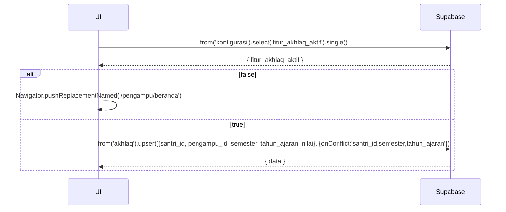

# UC-019 — Input Nilai Akhlaq

Document Version: v1.0
Use Case ID: UC-019
Use Case Name: Input Nilai Akhlaq
File Path: ./sys_uc_019.md
Status: Draft
Actors: Pengampu
Complexity: 🟢 Simple
Tabel Utama: akhlaq, konfigurasi

## Purpose

Pengampu menginput satu nilai akhlaq (0-100) per santri per semester. Fitur ini hanya aktif jika koordinator mengaktifkannya. Jika nonaktif, screen tidak dapat diakses dan menu tidak muncul.

## Preconditions

- Pengampu sudah login.
- Berada di screen `/pengampu/akhlaq`.
- `konfigurasi.fitur_akhlaq_aktif = true`.

## Main Flow

1. UI cek `konfigurasi.fitur_akhlaq_aktif` saat screen dimuat.
2. Jika false → arahkan ke `/pengampu/beranda` via `Navigator.pushReplacementNamed()`.
3. Jika true → UI menampilkan daftar santri halaqah dengan kolom nilai akhlaq semester ini.
4. Pengampu menekan "Input" atau "Edit" pada santri yang dipilih.
5. Modal muncul dengan field nilai (0-100).
6. Pengampu mengisi nilai → UI upsert ke `akhlaq`.
7. Tampilkan toast sukses.

## Alternate / Error Flows

- Fitur akhlaq nonaktif → screen diarahkan ke beranda, menu Akhlaq tidak muncul di Lainnya.
- Nilai di luar 0-100 → tampilkan "Nilai harus antara 0 dan 100".
- Field kosong → tampilkan "Nilai wajib diisi".

## Sequence Diagram



## API Contract (Supabase SDK)

```dart
// Cek status fitur
final config = await Supabase.instance.client
    .from('konfigurasi')
    .select('fitur_akhlaq_aktif')
    .single();

if (config['fitur_akhlaq_aktif'] == false) {
  Navigator.pushReplacementNamed(context, '/pengampu/beranda');
  return;
}

// Upsert nilai akhlaq
await Supabase.instance.client.from('akhlaq').upsert({
  'santri_id': santriId,
  'pengampu_id': currentUser.id,
  'semester': 'ganjil',
  'tahun_ajaran': '2025/2026',
  'nilai': 90,
  'updated_at': DateTime.now().toIso8601String(),
}, onConflict: 'santri_id,semester,tahun_ajaran');

// Read nilai akhlaq halaqah
final akhlaqList = await Supabase.instance.client
    .from('akhlaq')
    .select('*, santri!inner(nama_lengkap, halaqah_id)')
    .eq('santri.halaqah_id', halaqahId)
    .eq('semester', 'ganjil')
    .eq('tahun_ajaran', '2025/2026');
```

## Data Model

- `akhlaq` — id, santri_id, pengampu_id, semester, tahun_ajaran, nilai, created_at, updated_at
- `konfigurasi` — fitur_akhlaq_aktif

## Validation Rules

- santri_id: required, harus santri di halaqah pengampu yang login
- semester: required, enum (ganjil, genap)
- tahun_ajaran: required, format "YYYY/YYYY"
- nilai: required, integer 0-100
- Kombinasi santri_id + semester + tahun_ajaran unik

## Security & Permissions

- RLS `akhlaq`: pengampu hanya boleh INSERT/UPDATE untuk santri di halaqahnya.
- RLS `akhlaq`: koordinator dan kepsek boleh SELECT semua.
- Orang tua tidak boleh akses tabel `akhlaq`.

## Traceability

User Flow: userflow_uc_019.md
SRS: F-08