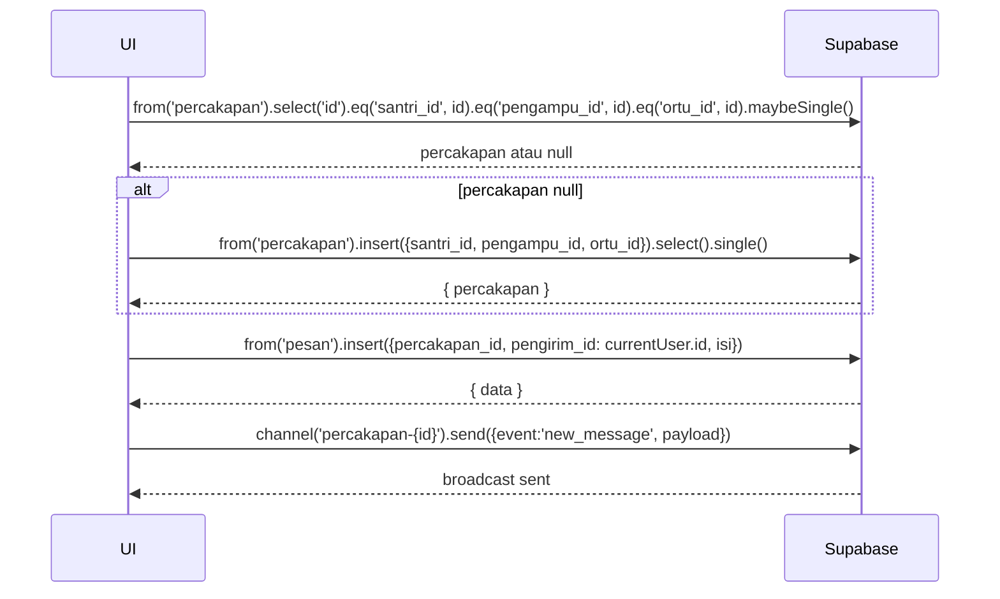

# UC-020 — Kirim & Balas Pesan ke Orang Tua

Document Version: v1.0
Use Case ID: UC-020
Use Case Name: Kirim & Balas Pesan ke Orang Tua
File Path: ./sys_uc_020.md
Status: Draft
Actors: Pengampu
Complexity: 🟡 Medium
Tabel Utama: percakapan, pesan

## Purpose

Pengampu mengirim dan membalas pesan teks kepada Orang Tua, terikat per santri. Thread percakapan dibuat otomatis saat pertama kali pesan dikirim. Pesan hanya format teks, tidak ada lampiran.

## Preconditions

- Pengampu sudah login.
- Berada di halaman `/pengampu/pesan`.
- Santri di halaqah pengampu memiliki akun Orang Tua.

## Main Flow

**Kirim Pesan Baru:**
1. UI menampilkan daftar percakapan per santri (hanya santri yang punya akun Orang Tua).
2. Pengampu memilih santri yang ingin dikirim pesan.
3. UI cek apakah sudah ada thread `percakapan` untuk kombinasi santri + pengampu + ortu.
4. Jika belum ada → UI insert ke `percakapan` untuk membuat thread baru.
5. UI membuka thread percakapan dan menampilkan riwayat pesan.
6. Pengampu mengetik pesan di field teks → menekan "Kirim".
7. UI insert ke `pesan`.
8. Supabase Realtime broadcast pesan baru ke channel Orang Tua.

**Balas Pesan:**
1. Pengampu membuka thread yang memiliki pesan dari Orang Tua.
2. Mengetik balasan → menekan "Kirim".
3. UI insert ke `pesan`.

## Alternate / Error Flows

- Field pesan kosong saat tombol Kirim ditekan → tombol tetap disabled, tidak ada insert.
- Santri tidak punya akun Orang Tua → thread tidak tersedia untuk santri tersebut, tidak muncul di daftar.
- Koneksi gagal saat kirim → tampilkan "Pesan gagal terkirim, coba lagi".

## Sequence Diagram



## API Contract (Supabase SDK)

```javascript
// Ambil daftar santri halaqah yang punya orang tua
const { data: santriList } = await supabase
  .from('santri')
  .select('id, nama_lengkap, orang_tua_id')
  .eq('halaqah_id', halaqahId)
  .not('orang_tua_id', 'is', null);

// Cek atau buat thread percakapan
let { data: percakapan } = await supabase
  .from('percakapan')
  .select('id')
  .eq('santri_id', santriId)
  .eq('pengampu_id', currentUser.id)
  .eq('ortu_id', santri.orang_tua_id)
  .maybeSingle();

if (!percakapan) {
  const { data } = await supabase
    .from('percakapan')
    .insert({
      santri_id: santriId,
      pengampu_id: currentUser.id,
      ortu_id: santri.orang_tua_id
    })
    .select()
    .single();
  percakapan = data;
}

// Kirim pesan
await supabase.from('pesan').insert({
  percakapan_id: percakapan.id,
  pengirim_id: currentUser.id,
  isi: isiPesan
});

// Subscribe realtime untuk terima balasan
supabase
  .channel(`percakapan-${percakapan.id}`)
  .on('postgres_changes', {
    event: 'INSERT',
    schema: 'public',
    table: 'pesan',
    filter: `percakapan_id=eq.${percakapan.id}`
  }, (payload) => {
    setMessages(prev => [...prev, payload.new]);
  })
  .subscribe();

// Ambil riwayat pesan
const { data: pesanList } = await supabase
  .from('pesan')
  .select('*')
  .eq('percakapan_id', percakapan.id)
  .order('created_at', { ascending: true });
```

## Data Model

- `percakapan` — id, santri_id, pengampu_id, ortu_id, created_at
- `pesan` — id, percakapan_id, pengirim_id, isi, created_at

## Validation Rules

- isi: required, tidak boleh kosong atau hanya whitespace
- percakapan_id: required, harus percakapan yang dimiliki pengampu yang login
- Kombinasi santri_id + pengampu_id + ortu_id unik di `percakapan`

## Security & Permissions

- RLS `percakapan`: pengampu hanya boleh SELECT dan INSERT percakapan yang `pengampu_id = auth.uid()`.
- RLS `pesan`: pengampu hanya boleh INSERT dan SELECT pesan dari percakapan miliknya.
- Orang tua hanya boleh akses percakapan yang `ortu_id = auth.uid()`.

## Traceability

User Flow: userflow_uc_020.md
SRS: F-13

---
