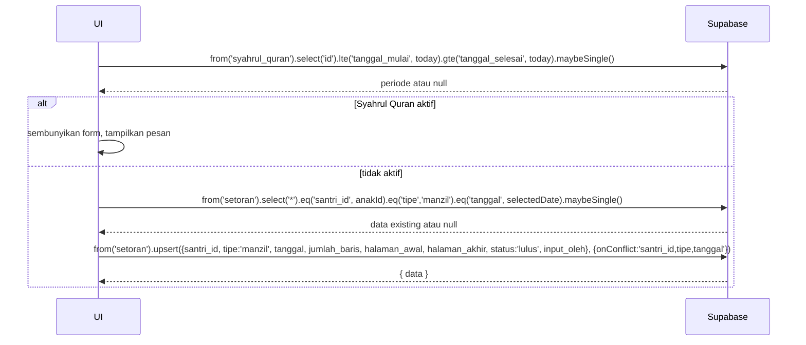

# UC-021 — Input Setoran Manzil

Document Version: v1.0
Use Case ID: UC-021
Use Case Name: Input Setoran Manzil
File Path: ./sys_uc_021.md
Status: Draft
Actors: Orang Tua
Complexity: 🟡 Medium
Tabel Utama: setoran, syahrul_quran

## Purpose

Orang Tua menginput setoran Manzil anak. Pengampu tidak bisa input Manzil. Manzil tidak bisa diinput saat periode Syahrul Quran aktif — form disembunyikan sepenuhnya. Jika punya lebih dari satu anak, Orang Tua memilih anak via tab di beranda terlebih dahulu.

## Preconditions

- Orang Tua sudah login.
- Berada di halaman `/ortu/manzil`.
- Periode Syahrul Quran tidak aktif.

## Main Flow

1. UI cek apakah Syahrul Quran aktif hari ini.
2. Jika aktif → tampilkan pesan "Setoran Manzil tidak tersedia selama Syahrul Quran" dan sembunyikan form.
3. Jika tidak aktif → UI menampilkan form input.
4. Jika punya lebih dari satu anak → tampilkan tab nama anak, Orang Tua memilih anak yang ingin diinput.
5. UI menampilkan form dengan tanggal (default hari ini, bisa diubah) dan field baris.
6. UI cek apakah sudah ada Manzil untuk anak + tanggal tersebut.
7. Jika sudah ada → tampilkan data existing di form untuk diedit.
8. Orang Tua mengisi atau mengubah (jumlah_baris, halaman_awal, halaman_akhir).
9. Orang Tua menekan "Simpan" → UI upsert ke `setoran` tipe manzil.
10. Tampilkan toast sukses.

## Alternate / Error Flows

- Syahrul Quran aktif → form tidak muncul sama sekali, bukan hanya disabled.
- Field wajib kosong → tampilkan "Field ini wajib diisi".
- halaman_akhir < halaman_awal → tampilkan "Halaman akhir tidak valid".

## Sequence Diagram



## API Contract (Supabase SDK)

```javascript
// Cek Syahrul Quran aktif
const today = new Date().toISOString().split('T')[0];
const { data: syahrul } = await supabase
  .from('syahrul_quran')
  .select('id')
  .lte('tanggal_mulai', today)
  .gte('tanggal_selesai', today)
  .maybeSingle();

if (syahrul) {
  return showMessage('Manzil tidak tersedia selama Syahrul Quran');
}

// Cek Manzil existing
const { data: existing } = await supabase
  .from('setoran')
  .select('*')
  .eq('santri_id', selectedAnakId)
  .eq('tipe', 'manzil')
  .eq('tanggal', selectedDate)
  .maybeSingle();

// Upsert Manzil
await supabase.from('setoran').upsert({
  santri_id: selectedAnakId,
  tipe: 'manzil',
  tanggal: selectedDate,
  jumlah_baris: jumlahBaris,
  halaman_awal: halamanAwal,
  halaman_akhir: halamanAkhir,
  status: 'lulus',
  input_oleh: currentUser.id,
  updated_at: new Date().toISOString()
}, { onConflict: 'santri_id,tipe,tanggal' });
```

## Data Model

- `setoran` — id, santri_id, tipe, tanggal, jumlah_baris, halaman_awal, halaman_akhir, status, input_oleh, created_at, updated_at
- `syahrul_quran` — id, tanggal_mulai, tanggal_selesai
- `santri` — id, nama_lengkap, orang_tua_id

## Validation Rules

- santri_id: required, harus anak milik orang tua yang login (`orang_tua_id = auth.uid()`)
- tanggal: required, format date
- jumlah_baris: required, integer > 0
- halaman_awal: required, integer > 0
- halaman_akhir: required, integer >= halaman_awal
- tipe: wajib `manzil`, tidak boleh sabak atau sabki
- status: selalu `lulus` untuk Manzil (tidak ada konsep mengulang untuk Manzil)

## Security & Permissions

- RLS `setoran` tipe manzil: hanya orang tua yang boleh INSERT/UPDATE (`input_oleh = auth.uid()`).
- RLS: orang tua hanya boleh input untuk anak mereka sendiri (`santri.orang_tua_id = auth.uid()`).
- Pengampu tidak boleh INSERT tipe manzil sama sekali.

## Traceability

User Flow: userflow_uc_021.md
SRS: F-03

---
