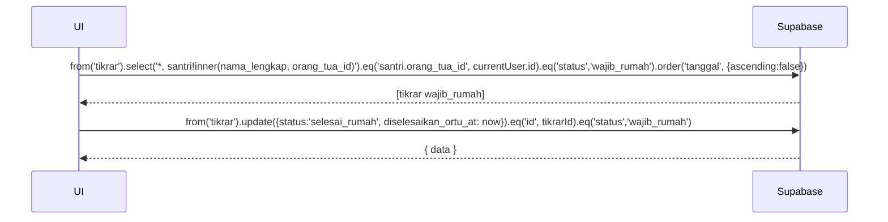

# UC-022 — Validasi Tikrar Rumah

Document Version: v1.0
Use Case ID: UC-022
Use Case Name: Validasi Tikrar Rumah
File Path: ./sys_uc_022.md
Status: Draft
Actors: Orang Tua
Complexity: 🟡 Medium
Tabel Utama: tikrar

## Purpose

Orang Tua memvalidasi bahwa Tikrar sudah diselesaikan di rumah dengan mengubah status dari `wajib_rumah` menjadi `selesai_rumah`. Ini adalah satu-satunya aksi yang bisa dilakukan Orang Tua pada tabel `tikrar`. Guard query memastikan status tidak bisa melompat.

## Preconditions

- Orang Tua sudah login.
- Berada di halaman `/ortu/tikrar`.
- Sudah ada record Tikrar dengan status `wajib_rumah` untuk anak mereka.

## Main Flow

1. UI mengambil daftar Tikrar anak dengan status `wajib_rumah`.
2. Jika punya lebih dari satu anak → tampilkan tab nama anak, Orang Tua memilih anak.
3. UI menampilkan daftar Tikrar yang perlu diselesaikan di rumah beserta detail (surah, tanggal).
4. Orang Tua menekan "Tandai Selesai di Rumah" pada Tikrar yang sudah dikerjakan.
5. Konfirmasi muncul "Apakah Tikrar ini sudah diselesaikan di rumah?".
6. Orang Tua menekan "Ya, Sudah Selesai".
7. UI update status Tikrar menjadi `selesai_rumah` dan isi `diselesaikan_ortu_at`.
8. Tikrar menghilang dari daftar (karena filter hanya `wajib_rumah`).
9. Tampilkan toast sukses.

## Alternate / Error Flows

- Tidak ada Tikrar dengan status `wajib_rumah` → tampilkan empty state "Tidak ada Tikrar yang perlu diselesaikan di rumah".
- Orang Tua menekan "Batal" → dialog tertutup, status tidak berubah.
- Guard query gagal (status sudah berubah sebelum update) → update tidak berpengaruh, refresh data.
- Koneksi gagal → tampilkan error state dengan tombol "Coba Lagi".

## Sequence Diagram



## API Contract (Supabase SDK)

```javascript
// Ambil Tikrar wajib_rumah anak orang tua yang login
const { data: tikrarList } = await supabase
  .from('tikrar')
  .select(`
    *,
    santri!inner(nama_lengkap, orang_tua_id)
  `)
  .eq('santri.orang_tua_id', currentUser.id)
  .eq('status', 'wajib_rumah')
  .order('tanggal', { ascending: false });

// Filter per anak jika punya lebih dari satu
const tikrarAnak = tikrarList.filter(t => t.santri_id === selectedAnakId);

// Validasi selesai di rumah
const { data, error } = await supabase
  .from('tikrar')
  .update({
    status: 'selesai_rumah',
    diselesaikan_ortu_at: new Date().toISOString()
  })
  .eq('id', tikrarId)
  .eq('status', 'wajib_rumah') // Guard — hanya update jika masih wajib_rumah
  .select();

// Jika data kosong (guard tidak terpenuhi) → refresh
if (!data || data.length === 0) {
  refetchTikrar();
}
```

## Data Model

- `tikrar` — id, santri_id, tanggal, surah, status, diselesaikan_pengampu_at, dialihkan_rumah_at, diselesaikan_ortu_at, created_at
- `santri` — id, nama_lengkap, orang_tua_id

## Validation Rules

- Orang tua hanya boleh update Tikrar milik anak mereka (`santri.orang_tua_id = auth.uid()`).
- Update hanya boleh dilakukan pada status `wajib_rumah`.
- Orang tua hanya boleh set status ke `selesai_rumah` — tidak boleh set status lain.
- Guard `.eq('status', 'wajib_rumah')` wajib ada di query update untuk mencegah race condition.

## Security & Permissions

- RLS `tikrar`: orang tua hanya boleh UPDATE tikrar anak mereka dan hanya bisa mengubah `status` menjadi `selesai_rumah` dan mengisi `diselesaikan_ortu_at`.
- RLS `tikrar`: orang tua tidak boleh INSERT atau DELETE.
- Pengampu tidak boleh set status ke `selesai_rumah` — hanya orang tua.

## Traceability

User Flow: userflow_uc_022.md
SRS: F-04

---

