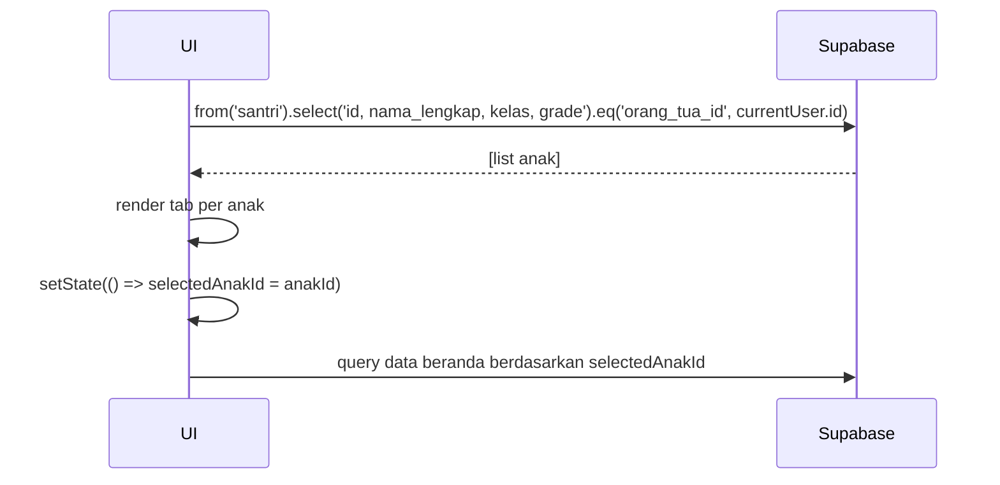

# UC-023 — Switch Antar Anak

Document Version: v1.0
Use Case ID: UC-023
Use Case Name: Switch Antar Anak
File Path: ./sys_uc_023.md
Status: Draft
Actors: Orang Tua
Complexity: 🟢 Simple
Tabel Utama: santri, orang_tua

## Purpose

Orang Tua yang memiliki lebih dari satu anak dapat berpindah konteks antar anak melalui tab nama di screen beranda. Seluruh data yang ditampilkan menyesuaikan anak yang dipilih.

## Preconditions

- Orang Tua sudah login.
- Akun terhubung ke lebih dari satu santri.
- Berada di screen `/ortu/beranda`.

## Main Flow

1. UI mengambil semua santri yang `orang_tua_id = currentUser.id`.
2. Jika lebih dari satu anak → tampilkan tab nama anak di bagian atas beranda.
3. Orang Tua menekan tab nama anak yang dipilih.
4. UI menyimpan `selectedAnakId` ke state lokal via `setState()`.
5. Seluruh data di beranda (setoran, tikrar, absensi) diambil ulang berdasarkan `selectedAnakId`.

## Alternate / Error Flows

- Hanya satu anak → tab tidak ditampilkan, langsung load data anak tersebut.

## Sequence Diagram



## API Contract (Supabase SDK)

```dart
// Ambil semua anak
final anakList = await Supabase.instance.client
    .from('santri')
    .select('id, nama_lengkap, kelas, grade, halaqah(nama_halaqah)')
    .eq('orang_tua_id', currentUser.id)
    .order('nama_lengkap');

// State di Flutter Widget
String? selectedAnakId;

@override
void initState() {
  super.initState();
  selectedAnakId = anakList.isNotEmpty ? anakList[0]['id'] : null;
}

// Saat tab ditekan
setState(() {
  selectedAnakId = anakId;
});
```

## Data Model

- `santri` — id, nama_lengkap, kelas, grade, orang_tua_id, halaqah_id

## Validation Rules

Tidak ada — hanya perpindahan state lokal.

## Security & Permissions

- RLS `santri`: orang tua hanya boleh SELECT santri yang `orang_tua_id = auth.uid()`.

## Traceability

User Flow: userflow_uc_023.md
SRS: F-01