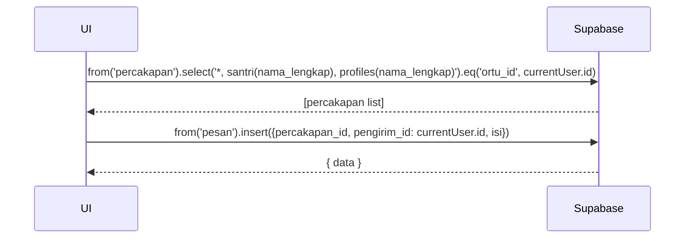

# UC-024 — Kirim & Balas Pesan ke Pengampu

Document Version: v1.0
Use Case ID: UC-024
Use Case Name: Kirim & Balas Pesan ke Pengampu
File Path: ./sys_uc_024.md
Status: Draft
Actors: Orang Tua
Complexity: 🟡 Medium
Tabel Utama: percakapan, pesan

## Purpose

Orang Tua mengirim dan membalas pesan teks kepada Pengampu, terikat per santri. Thread percakapan dibuat otomatis jika belum ada.

## Preconditions

- Orang Tua sudah login.
- Berada di halaman `/ortu/pesan`.

## Main Flow

1. UI menampilkan daftar percakapan per anak (join `percakapan` + `santri` + `profiles` pengampu).
2. Orang Tua memilih percakapan → UI membuka thread.
3. Jika belum ada `percakapan` untuk kombinasi santri + pengampu + ortu → UI insert ke `percakapan`.
4. Orang Tua mengetik pesan dan menekan "Kirim".
5. UI insert ke `pesan`.
6. Supabase Realtime mengirim notifikasi ke channel pengampu.

## Alternate / Error Flows

- Field pesan kosong → tombol Kirim disabled.
- Koneksi gagal → tampilkan "Pesan gagal terkirim".

## Sequence Diagram



## API Contract (Supabase SDK)

```javascript
// Ambil daftar percakapan orang tua
const { data: percakapanList } = await supabase
  .from('percakapan')
  .select(`
    id,
    santri(nama_lengkap),
    profiles(nama_lengkap)
  `)
  .eq('ortu_id', currentUser.id);

// Kirim pesan
await supabase.from('pesan').insert({
  percakapan_id: percakapan.id,
  pengirim_id: currentUser.id,
  isi: 'Isi pesan teks'
});

// Subscribe realtime
supabase.channel(`percakapan-${percakapan.id}`)
  .on('postgres_changes', {
    event: 'INSERT', schema: 'public',
    table: 'pesan',
    filter: `percakapan_id=eq.${percakapan.id}`
  }, handleNewMessage)
  .subscribe();
```

## Data Model

- `percakapan` — id, santri_id, pengampu_id, ortu_id, created_at
- `pesan` — id, percakapan_id, pengirim_id, isi, created_at

## Validation Rules

- isi: required, tidak boleh kosong, teks saja

## Security & Permissions

- RLS `percakapan`: orang tua hanya boleh akses percakapan yang `ortu_id = auth.uid()`.
- RLS `pesan`: hanya boleh akses pesan dari percakapan yang dimiliki user.

## Traceability

User Flow: userflow_uc_024.md
SRS: F-13

---
