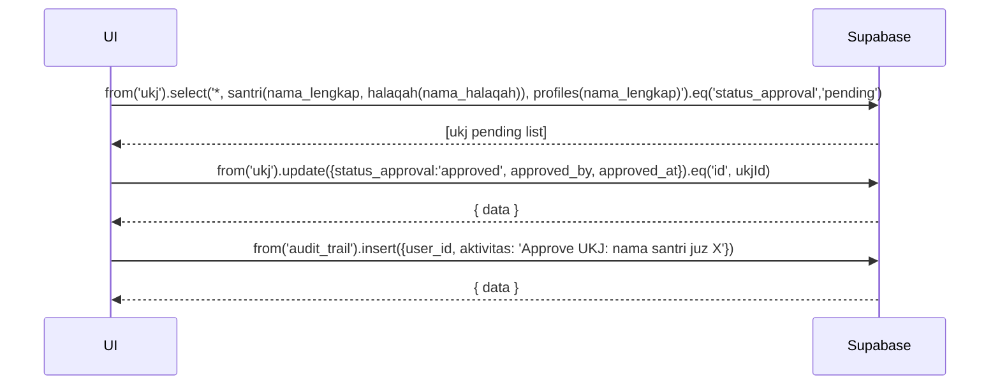

---

# UC-025 — Approve / Reject UKJ

Document Version: v1.0
Use Case ID: UC-025
Use Case Name: Approve / Reject UKJ
File Path: ./sys_uc_025.md
Status: Draft
Actors: Koordinator
Complexity: 🟡 Medium
Tabel Utama: ukj, audit_trail

## Purpose

Koordinator menyetujui atau menolak hasil UKJ yang diinput pengampu. UKJ yang sudah approved tidak dapat diubah pengampu. Record yang ditolak tetap tersimpan sebagai riwayat.

## Preconditions

- Koordinator sudah login.
- Berada di halaman `/koordinator/ukj`.
- Ada UKJ dengan `status_approval = 'pending'`.

## Main Flow

**Approve:**
1. UI menampilkan daftar UKJ pending (join santri, halaqah, pengampu).
2. Koordinator menekan "Approve" → konfirmasi.
3. UI update `ukj.status_approval = 'approved'`, isi `approved_by` dan `approved_at`.
4. Catat ke `audit_trail`.

**Reject:**
1. Koordinator menekan "Tolak" → modal muncul untuk isi alasan penolakan.
2. UI update `ukj.status_approval = 'rejected'` dan isi `alasan_penolakan`, `approved_by`, `approved_at`.
3. Catat ke `audit_trail`.

## Alternate / Error Flows

- Tidak ada UKJ pending → tampilkan empty state.
- Koordinator menekan "Batal" → tidak ada perubahan.

## Sequence Diagram



## API Contract (Supabase SDK)

```javascript
// Approve UKJ
await supabase.from('ukj')
  .update({
    status_approval: 'approved',
    approved_by: currentUser.id,
    approved_at: new Date().toISOString()
  })
  .eq('id', ukjId)
  .eq('status_approval', 'pending'); // Guard

await supabase.from('audit_trail').insert({
  user_id: currentUser.id,
  aktivitas: `Approve UKJ: ${santriNama} Juz ${nomorJuz}`
});

// Reject UKJ
await supabase.from('ukj')
  .update({
    status_approval: 'rejected',
    alasan_penolakan: alasan,
    approved_by: currentUser.id,
    approved_at: new Date().toISOString()
  })
  .eq('id', ukjId)
  .eq('status_approval', 'pending');

await supabase.from('audit_trail').insert({
  user_id: currentUser.id,
  aktivitas: `Reject UKJ: ${santriNama} Juz ${nomorJuz}`
});
```

## Data Model

- `ukj` — id, santri_id, pengampu_id, nomor_juz, nilai, status_santri, status_approval, alasan_penolakan, approved_by, approved_at
- `audit_trail` — id, user_id, aktivitas, created_at

## Validation Rules

- alasan_penolakan: required saat reject
- Guard `.eq('status_approval', 'pending')` wajib ada di setiap update

## Security & Permissions

- RLS `ukj`: hanya koordinator yang boleh UPDATE kolom `status_approval`, `approved_by`, `approved_at`, `alasan_penolakan`.

## Traceability

User Flow: userflow_uc_025.md
SRS: F-05

---
