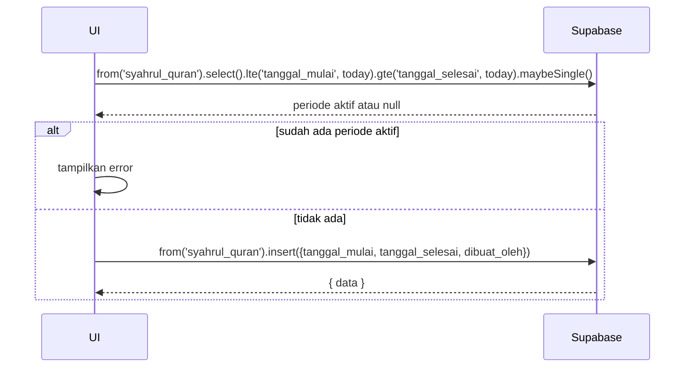

# UC-026 — Kelola Periode Syahrul Quran

Document Version: v1.0
Use Case ID: UC-026
Use Case Name: Kelola Periode Syahrul Quran
File Path: ./sys_uc_026.md
Status: Draft
Actors: Koordinator
Complexity: 🟡 Medium
Tabel Utama: syahrul_quran

## Purpose

Koordinator menetapkan periode Syahrul Quran dengan tanggal mulai dan selesai. Selama periode aktif, input Sabki dan Manzil disembunyikan dari antarmuka.

## Preconditions

- Koordinator sudah login.
- Berada di halaman `/koordinator/kelola/syahrul-quran`.
- Tidak ada periode Syahrul Quran yang sedang aktif (untuk membuat baru).

## Main Flow

**Tetapkan Periode:**
1. Koordinator menekan "Tetapkan Periode Baru".
2. Koordinator mengisi tanggal mulai dan selesai → menekan "Simpan".
3. UI cek apakah sudah ada periode aktif.
4. Jika tidak ada → UI insert ke `syahrul_quran`.

**Akhiri Lebih Awal:**
1. Koordinator menekan "Akhiri Periode Sekarang" → konfirmasi.
2. UI update `tanggal_selesai = today` pada record aktif.

## Alternate / Error Flows

- Tanggal selesai lebih awal dari mulai → tampilkan error "Tanggal tidak valid".
- Sudah ada periode aktif → tampilkan "Akhiri periode aktif terlebih dahulu".

## Sequence Diagram



## API Contract (Supabase SDK)

```javascript
const today = new Date().toISOString().split('T')[0];

// Cek periode aktif
const { data: aktif } = await supabase
  .from('syahrul_quran')
  .select('id')
  .lte('tanggal_mulai', today)
  .gte('tanggal_selesai', today)
  .maybeSingle();

if (aktif) throw new Error('Sudah ada periode aktif');

// Buat periode baru
await supabase.from('syahrul_quran').insert({
  tanggal_mulai: '2025-10-01',
  tanggal_selesai: '2025-10-31',
  dibuat_oleh: currentUser.id
});

// Akhiri lebih awal
await supabase.from('syahrul_quran')
  .update({ tanggal_selesai: today })
  .eq('id', periodeAktifId);
```

## Data Model

- `syahrul_quran` — id, tanggal_mulai, tanggal_selesai, dibuat_oleh, created_at

## Validation Rules

- tanggal_mulai: required, format date
- tanggal_selesai: required, >= tanggal_mulai
- Tidak boleh overlap dengan periode yang sudah ada

## Security & Permissions

- RLS `syahrul_quran`: hanya koordinator yang boleh INSERT dan UPDATE.
- Semua authenticated user boleh SELECT.

## Traceability

User Flow: userflow_uc_026.md
SRS: F-09

---
