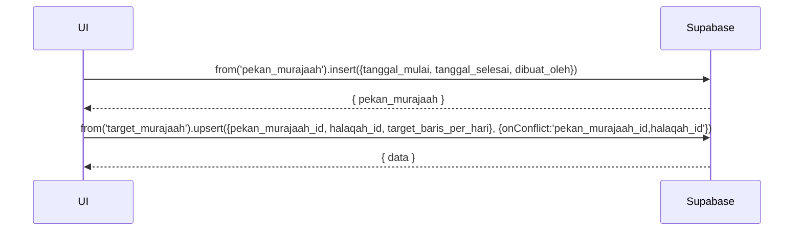

# UC-027 — Kelola Pekan Murajaah

Document Version: v1.0
Use Case ID: UC-027
Use Case Name: Kelola Pekan Murajaah
File Path: ./sys_uc_027.md
Status: Draft
Actors: Koordinator
Complexity: 🟡 Medium
Tabel Utama: pekan_murajaah, target_murajaah

## Purpose

Koordinator menetapkan periode Pekan Murajaah dan Pengampu menginput target harian per halaqah secara manual setelah diberitahu koordinator.

## Preconditions

- Koordinator sudah login.
- Berada di halaman `/koordinator/kelola/pekan-murajaah`.

## Main Flow

**Tetapkan Periode:**
1. Koordinator menekan "Tetapkan Periode Baru".
2. Koordinator mengisi tanggal mulai dan selesai → menekan "Simpan".
3. UI cek tidak ada periode aktif yang overlap.
4. UI insert ke `pekan_murajaah`.
5. Koordinator menginformasikan target ke pengampu di luar sistem.

**Input Target per Halaqah (dilakukan Pengampu):**
1. Pengampu melihat notifikasi Pekan Murajaah aktif.
2. Pengampu membuka halaman setoran → ada field input target harian.
3. UI upsert ke `target_murajaah` per halaqah.

**Akhiri Lebih Awal:**
1. Koordinator menekan "Akhiri Periode" → konfirmasi.
2. UI update `tanggal_selesai = today`.

## Alternate / Error Flows

- Sudah ada periode aktif → tampilkan "Akhiri periode aktif terlebih dahulu".
- Tanggal tidak valid → tampilkan error.

## Sequence Diagram



## API Contract (Supabase SDK)

```javascript
// Buat periode Pekan Murajaah
const { data: pekan } = await supabase
  .from('pekan_murajaah')
  .insert({
    tanggal_mulai: '2025-04-27',
    tanggal_selesai: '2025-05-15',
    dibuat_oleh: currentUser.id
  })
  .select()
  .single();

// Input target per halaqah (oleh pengampu)
await supabase.from('target_murajaah').upsert({
  pekan_murajaah_id: pekan.id,
  halaqah_id: pengampu.halaqah_id,
  target_baris_per_hari: 14 // koordinator informasikan manual
}, { onConflict: 'pekan_murajaah_id,halaqah_id' });

// Cek periode aktif
const { data: aktif } = await supabase
  .from('pekan_murajaah')
  .select('id, tanggal_mulai, tanggal_selesai')
  .lte('tanggal_mulai', today)
  .gte('tanggal_selesai', today)
  .maybeSingle();
```

## Data Model

- `pekan_murajaah` — id, tanggal_mulai, tanggal_selesai, dibuat_oleh, created_at
- `target_murajaah` — id, pekan_murajaah_id, halaqah_id, target_baris_per_hari, created_at

## Validation Rules

- tanggal_mulai: required, format date
- tanggal_selesai: required, >= tanggal_mulai
- target_baris_per_hari: required, integer > 0
- Tidak boleh overlap periode aktif

## Security & Permissions

- RLS `pekan_murajaah`: hanya koordinator yang boleh INSERT dan UPDATE.
- RLS `target_murajaah`: pengampu hanya boleh INSERT/UPDATE untuk halaqahnya sendiri.

## Traceability

User Flow: userflow_uc_027.md
SRS: F-10

---
