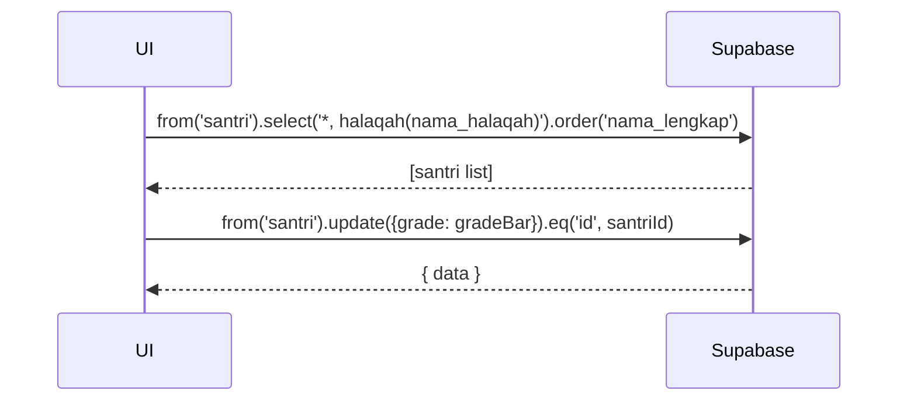

---

# UC-028 — Ubah Grade Santri

Document Version: v1.0
Use Case ID: UC-028
Use Case Name: Ubah Grade Santri
File Path: ./sys_uc_028.md
Status: Draft
Actors: Koordinator
Complexity: 🟢 Simple
Tabel Utama: santri, target_grade

## Purpose

Koordinator mengubah grade (Marhalah) santri secara manual. Grade bersifat independen dari kelas dan tidak ada trigger otomatis.

## Preconditions

- Koordinator sudah login.
- Berada di halaman `/koordinator/kelola/grade`.

## Main Flow

1. UI menampilkan daftar seluruh santri dengan grade saat ini, halaqah, dan kelas.
2. Koordinator memfilter berdasarkan halaqah atau grade jika perlu.
3. Koordinator menekan "Ubah Grade" pada santri yang dipilih.
4. Modal muncul dengan dropdown pilihan grade: Tahsin, Takmil, Tahfiz.
5. Koordinator memilih grade baru → menekan "Simpan".
6. UI update `santri.grade` dan tampilkan toast sukses.

## Alternate / Error Flows

- Grade baru sama dengan grade saat ini → tampilkan "Grade tidak berubah", batalkan update.
- Koneksi gagal → tampilkan error state.

## Sequence Diagram



## API Contract (Supabase SDK)

```javascript
// Read semua santri dengan halaqah
const { data: santriList } = await supabase
  .from('santri')
  .select('id, nama_lengkap, kelas, grade, halaqah(nama_halaqah)')
  .order('nama_lengkap');

// Update grade
if (gradeBaru === gradeLama) return showMessage('Grade tidak berubah');

await supabase.from('santri')
  .update({ grade: gradeBaru })
  .eq('id', santriId);
```

## Data Model

- `santri` — id, nama_lengkap, kelas, grade, halaqah_id
- `target_grade` — grade, target_min, target_max (dibaca untuk informasi target baru)

## Validation Rules

- grade: required, enum (tahsin, takmil, tahfiz)
- Grade baru tidak boleh sama dengan grade saat ini

## Security & Permissions

- RLS `santri`: hanya koordinator yang boleh UPDATE kolom `grade`.

## Traceability

User Flow: userflow_uc_028.md
SRS: F-18

---
