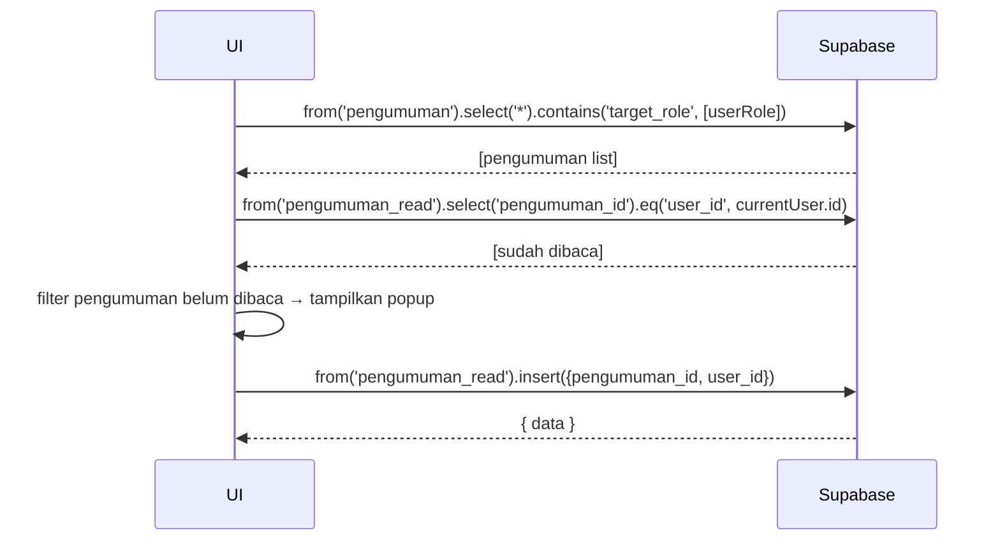

# UC-029 — Buat & Kelola Pengumuman

Document Version: v1.0
Use Case ID: UC-029
Use Case Name: Buat & Kelola Pengumuman
File Path: ./sys_uc_029.md
Status: Draft
Actors: Koordinator
Complexity: 🟡 Medium
Tabel Utama: pengumuman, pengumuman_read

## Purpose

Koordinator membuat pengumuman yang ditujukan ke role tertentu. Pengumuman muncul sebagai popup saat pengguna login pertama kali setelah pengumuman diterbitkan dan tidak muncul lagi setelah diklik.

## Preconditions

- Koordinator sudah login.
- Berada di halaman `/koordinator/pengumuman`.

## Main Flow

**Buat Pengumuman:**
1. Koordinator menekan "Buat Pengumuman".
2. Mengisi judul, isi, dan target role (bisa pilih lebih dari satu).
3. UI insert ke `pengumuman`.

**Hapus Pengumuman:**
1. Koordinator menekan "Hapus" → konfirmasi.
2. UI delete baris dari `pengumuman` (cascade delete `pengumuman_read`).

**Saat User Login (semua role):**
1. UI query `pengumuman` yang `target_role` mengandung role user.
2. UI query `pengumuman_read` untuk cek pengumuman mana yang sudah dibaca user ini.
3. Tampilkan popup untuk pengumuman yang belum ada di `pengumuman_read`.
4. Saat user klik popup → UI insert ke `pengumuman_read`.

## Alternate / Error Flows

- Field judul atau isi kosong → tampilkan "Field ini wajib diisi".
- Tidak ada role yang dipilih → tampilkan "Pilih minimal satu role penerima".

## Sequence Diagram



## API Contract (Supabase SDK)

```javascript
// Buat pengumuman
await supabase.from('pengumuman').insert({
  judul: 'Pengumuman Pekan Murajaah',
  isi: 'Isi pengumuman...',
  target_role: ['pengampu', 'orang_tua'],
  dibuat_oleh: currentUser.id
});

// Cek pengumuman belum dibaca saat login
const { data: semuaPengumuman } = await supabase
  .from('pengumuman')
  .select('*')
  .contains('target_role', [userRole]);

const { data: sudahDibaca } = await supabase
  .from('pengumuman_read')
  .select('pengumuman_id')
  .eq('user_id', currentUser.id);

const sudahDibacaIds = sudahDibaca.map(r => r.pengumuman_id);
const belumDibaca = semuaPengumuman.filter(p => !sudahDibacaIds.includes(p.id));

// Tandai sudah dibaca saat popup diklik
await supabase.from('pengumuman_read').insert({
  pengumuman_id: pengumumanId,
  user_id: currentUser.id
});
```

## Data Model

- `pengumuman` — id, judul, isi, target_role (array), dibuat_oleh, created_at
- `pengumuman_read` — id, pengumuman_id, user_id, read_at

## Validation Rules

- judul: required
- isi: required
- target_role: required, minimal satu role, array dari enum role yang valid
- Kombinasi pengumuman_id + user_id unik di `pengumuman_read`

## Security & Permissions

- RLS `pengumuman`: hanya koordinator dan TU yang boleh INSERT dan DELETE.
- RLS `pengumuman`: semua authenticated user boleh SELECT yang `target_role` mengandung role mereka.
- RLS `pengumuman_read`: user hanya boleh INSERT dan SELECT milik sendiri.

## Traceability

User Flow: userflow_uc_029.md
SRS: F-14

---
