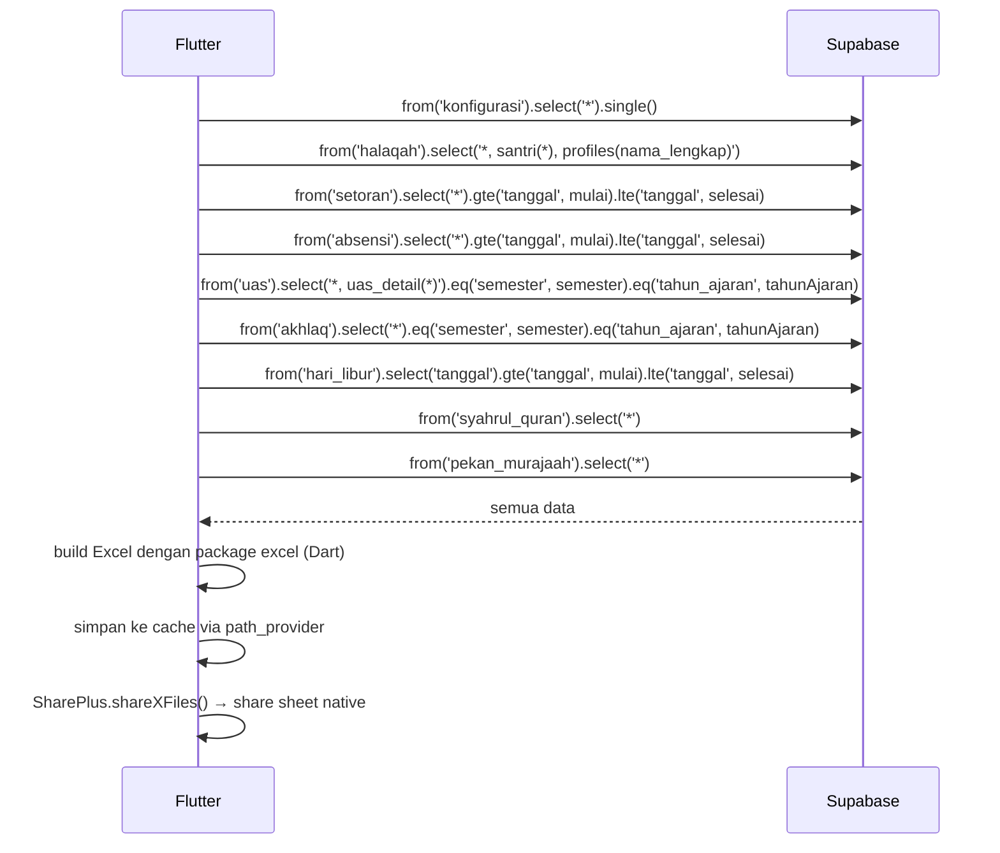

# UC-030 — Download Rekap Excel (Koordinator)

Document Version: v1.0
Use Case ID: UC-030
Use Case Name: Download Rekap Excel
File Path: ./sys_uc_030.md
Status: Draft
Actors: Koordinator
Complexity: 🔴 Complex
Tabel Utama: setoran, absensi, uas, uas_detail, akhlaq, hari_libur, syahrul_quran, pekan_murajaah, konfigurasi

## Purpose

Koordinator men-generate dan membagikan file Excel rekap semester seluruh santri, dikelompokkan per halaqah. File berisi setoran per pekan per bulan, nilai akhir, rank per halaqah, dengan penandaan khusus untuk pekan Syahrul Quran (★) dan Pekan Murajaah. File dibagikan via share sheet native perangkat menggunakan package `share_plus`.

## Preconditions

- Koordinator sudah login.
- Berada di screen `/koordinator/rekap`.
- Konfigurasi tanggal semester sudah diisi TU.

## Main Flow

1. Koordinator memilih semester (ganjil/genap) dan tahun ajaran → menekan "Generate Rekap".
2. UI mengambil seluruh data yang dibutuhkan dari Supabase secara paralel.
3. UI membangun struktur Excel per halaqah menggunakan package `excel` (Dart).
4. Untuk setiap pekan, UI cek apakah masuk periode Syahrul Quran (tandai ★) atau Pekan Murajaah (tandai khusus).
5. UI hitung nilai akhir per santri menggunakan formula dari `konfigurasi`.
6. UI hitung rank per halaqah berdasarkan nilai akhir.
7. UI menyimpan file sementara ke direktori cache perangkat via `path_provider`.
8. UI membuka share sheet native via `share_plus` — user dapat menyimpan ke Files, mengirim via WhatsApp, email, dsb.

## Formula Kalkulasi Nilai Akhir

```
Nilai Setoran Harian = (total_baris_aktual / total_baris_target) × 100, maks 100
Nilai Kehadiran = ((hari_efektif - jumlah_alpha) / hari_efektif) × 100
Nilai Akhir = (setoran × bobot_setoran%) + (uas × bobot_uas%) + (akhlaq × bobot_akhlaq%) + (kehadiran × bobot_kehadiran%)
```

Dalam Setoran:
```
Nilai Setoran = (Sabak × 30%) + (Sabki × 30%) + (Manzil × 40%)
```

## Hari Efektif

- Senin–Jumat saja
- Dikurangi tanggal yang ada di tabel `hari_libur`
- Dikurangi periode Syahrul Quran (karena Sabki dan Manzil tidak dihitung)

## Struktur Kolom Excel Per Sheet (Per Halaqah)

```
[No + Nama Lengkap + Kelas]
[Bulan 1: Pekan 1 Sabak | Sabki | Manzil | Pekan 2 ... | Tidak Tercapai | Total Bulan]
[Bulan 2: ...]
[Total Semester Sabak | Sabki | Manzil]
[Total Hari Efektif]
[Nilai Setoran Harian 40%]
[Nilai UAS 40%]
[Nilai Akhlaq 10%]
[Nilai Kehadiran 10%]
[Nilai Raport]
[Rank]
```

## Alternate / Error Flows

- Filter belum dipilih → tampilkan "Pilih semester dan tahun ajaran".
- Tidak ada data → tampilkan "Tidak ada data untuk semester ini".
- Generate gagal → tampilkan error state dengan tombol "Coba Lagi".

## Sequence Diagram



## API Contract (Supabase SDK)

```dart
// Ambil semua data secara paralel
final results = await Future.wait([
  Supabase.instance.client.from('konfigurasi').select('*').single(),
  Supabase.instance.client.from('halaqah').select('*, profiles(nama_lengkap), santri(id, nama_lengkap, kelas, grade)'),
  Supabase.instance.client.from('setoran').select('*').gte('tanggal', tanggalMulai).lte('tanggal', tanggalSelesai),
  Supabase.instance.client.from('absensi').select('*').gte('tanggal', tanggalMulai).lte('tanggal', tanggalSelesai),
  Supabase.instance.client.from('uas').select('*, uas_detail(*)').eq('semester', semester).eq('tahun_ajaran', tahunAjaran),
  Supabase.instance.client.from('akhlaq').select('*').eq('semester', semester).eq('tahun_ajaran', tahunAjaran),
  Supabase.instance.client.from('hari_libur').select('tanggal').gte('tanggal', tanggalMulai).lte('tanggal', tanggalSelesai),
  Supabase.instance.client.from('syahrul_quran').select('*'),
  Supabase.instance.client.from('pekan_murajaah').select('*'),
]);

// Generate Excel dengan package excel (Dart)
// pubspec.yaml: excel: ^4.0.0, path_provider: ^2.0.0, share_plus: ^7.0.0
import 'package:excel/excel.dart';
import 'package:path_provider/path_provider.dart';
import 'package:share_plus/share_plus.dart';

final excel = Excel.createExcel();

for (final halaqah in halaqahList) {
  final sheet = excel[halaqah['nama_halaqah']];
  // isi baris data per santri...
}

// Simpan ke cache
final dir = await getTemporaryDirectory();
final filePath = '${dir.path}/Rekap_${semester}_${tahunAjaran}.xlsx';
final fileBytes = excel.save()!;
final file = File(filePath);
await file.writeAsBytes(fileBytes);

// Buka share sheet native
await SharePlus.instance.shareXFiles(
  [XFile(filePath)],
  subject: 'Rekap $semester $tahunAjaran',
);
```

## Data Model

Melibatkan: konfigurasi, halaqah, santri, profiles, setoran, absensi, uas, uas_detail, akhlaq, hari_libur, syahrul_quran, pekan_murajaah, target_murajaah

## Validation Rules

- semester: required, enum (ganjil, genap)
- tahun_ajaran: required, format "YYYY/YYYY"

## Security & Permissions

- RLS: koordinator boleh SELECT semua tabel yang dibutuhkan.

## Traceability

User Flow: userflow_uc_030.md
SRS: F-11, F-12
```

---
