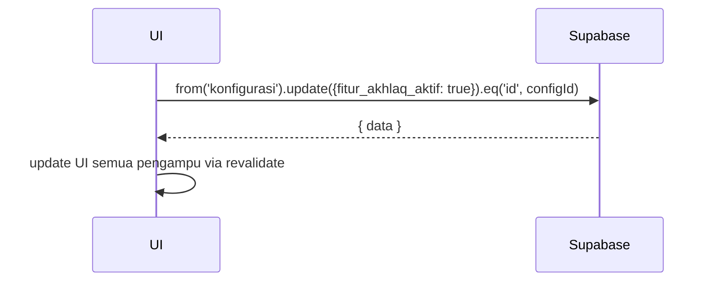

# UC-031 — Aktifkan / Nonaktifkan Fitur Akhlaq

Document Version: v1.0
Use Case ID: UC-031
Use Case Name: Aktifkan / Nonaktifkan Fitur Akhlaq
File Path: ./sys_uc_031.md
Status: Draft
Actors: Koordinator
Complexity: 🟢 Simple
Tabel Utama: konfigurasi

## Purpose

Koordinator mengaktifkan atau menonaktifkan fitur penilaian akhlaq. Saat nonaktif, menu akhlaq tidak muncul di antarmuka pengampu dan nilai akhlaq tidak dihitung dalam nilai akhir.

## Preconditions

- Koordinator sudah login.
- Berada di halaman beranda koordinator atau menu pengaturan.

## Main Flow

**Aktifkan:**
1. Koordinator menekan toggle "Fitur Penilaian Akhlaq" → konfirmasi.
2. UI update `konfigurasi.fitur_akhlaq_aktif = true`.
3. Menu Akhlaq muncul di halaman Lainnya pengampu.

**Nonaktifkan:**
1. Koordinator menekan toggle yang sedang aktif → konfirmasi.
2. UI update `konfigurasi.fitur_akhlaq_aktif = false`.
3. Menu Akhlaq hilang dari halaman Lainnya pengampu.
4. Data akhlaq yang sudah diinput tetap tersimpan.

## Alternate / Error Flows

- Koordinator menekan "Batal" → toggle kembali ke posisi semula.
- Koneksi gagal → toggle kembali ke posisi semula, tampilkan error.

## Sequence Diagram



## API Contract (Supabase SDK)

```javascript
// Toggle fitur akhlaq
await supabase.from('konfigurasi')
  .update({
    fitur_akhlaq_aktif: isAktif,
    updated_at: new Date().toISOString()
  })
  .eq('id', configId);

// Di sisi pengampu — cek status saat render menu
const { data: config } = await supabase
  .from('konfigurasi')
  .select('fitur_akhlaq_aktif')
  .single();

// Jika false → sembunyikan menu Akhlaq dari Lainnya
```

## Data Model

- `konfigurasi` — fitur_akhlaq_aktif, updated_at

## Validation Rules

- fitur_akhlaq_aktif: boolean

## Security & Permissions

- RLS `konfigurasi`: hanya koordinator dan TU yang boleh UPDATE.

## Traceability

User Flow: userflow_uc_031.md
SRS: F-08

---
