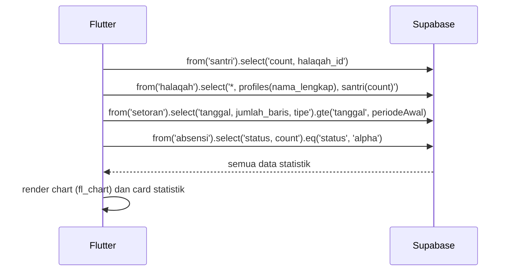

# UC-032 — Lihat Dashboard Statistik

Document Version: v1.0
Use Case ID: UC-032
Use Case Name: Lihat Dashboard Statistik
File Path: ./sys_uc_032.md
Status: Draft
Actors: Kepala Sekolah
Complexity: 🟡 Medium
Tabel Utama: santri, halaqah, setoran, absensi

## Purpose

Kepala Sekolah melihat dashboard statistik program tahfiz secara keseluruhan. Hanya read-only, tidak ada aksi input.

## Preconditions

- Kepsek sudah login.
- Berada di screen `/kepsek/dashboard`.
- Sudah ada data santri dan setoran di sistem.

## Main Flow

1. UI mengambil data statistik secara paralel dari Supabase.
2. UI menampilkan dashboard berisi:
   - Total santri aktif per halaqah.
   - Total halaqah dan pengampu.
   - Grafik perkembangan total baris setoran per bulan menggunakan package `fl_chart`.
   - Rata-rata nilai setoran per halaqah.
   - Statistik kehadiran (persentase alpha keseluruhan).
3. Kepsek dapat filter berdasarkan semester atau bulan tertentu.

## Alternate / Error Flows

- Data belum ada → tampilkan empty state per komponen statistik.
- Gagal fetch → tampilkan error state dengan tombol "Coba Lagi".

## Sequence Diagram



## API Contract (Supabase SDK)

```dart
// Paralel fetch semua statistik
final results = await Future.wait([
  Supabase.instance.client
      .from('santri')
      .select('*', const FetchOptions(count: CountOption.exact, head: true)),

  Supabase.instance.client
      .from('halaqah')
      .select('id, nama_halaqah, grade, profiles(nama_lengkap), santri(count)'),

  Supabase.instance.client
      .from('setoran')
      .select('tanggal, jumlah_baris, tipe')
      .gte('tanggal', periodeAwal)
      .lte('tanggal', periodeAkhir),

  Supabase.instance.client
      .from('absensi')
      .select('*', const FetchOptions(count: CountOption.exact, head: true))
      .eq('status', 'alpha')
      .gte('tanggal', periodeAwal),
]);

// Data untuk fl_chart — aggregate per bulan
// pubspec.yaml: fl_chart: ^0.68.0
import 'package:fl_chart/fl_chart.dart';

final chartSpots = aggregateByMonth(setoranData)
    .asMap()
    .entries
    .map((e) => FlSpot(e.key.toDouble(), e.value.toDouble()))
    .toList();

LineChartData(
  lineBarsData: [
    LineChartBarData(spots: chartSpots),
  ],
);
```

## Data Model

- `santri` — id, halaqah_id, grade
- `halaqah` — id, nama_halaqah, grade, pengampu_id
- `setoran` — tanggal, jumlah_baris, tipe, santri_id
- `absensi` — tanggal, status, santri_id

## Validation Rules

Tidak ada input user — hanya filter tampilan.

## Security & Permissions

- RLS: Kepsek boleh SELECT semua tabel yang dibutuhkan tanpa batasan.
- Kepsek tidak boleh melakukan INSERT, UPDATE, atau DELETE pada tabel apapun.

## Traceability

User Flow: userflow_uc_032.md
SRS: F-17
```

---
