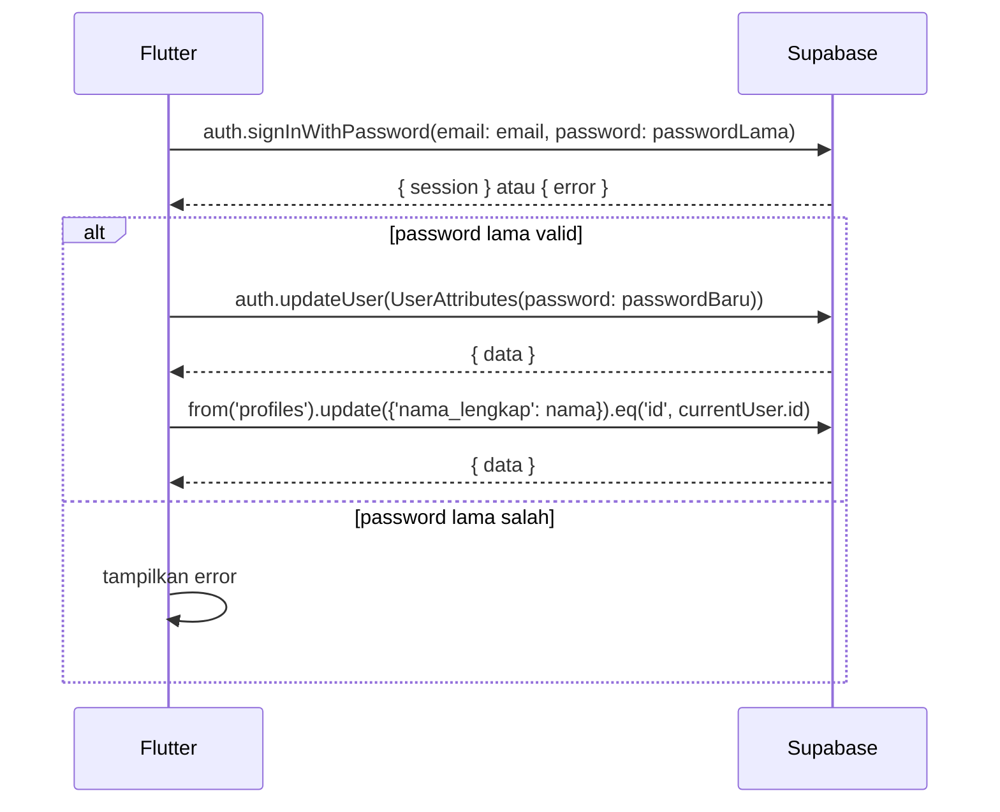

# UC-034 — Edit Profil & Ganti Password

Document Version: v1.0
Use Case ID: UC-034
Use Case Name: Edit Profil & Ganti Password
File Path: ./sys_uc_034.md
Status: Draft
Actors: Semua Role
Complexity: 🟢 Simple
Tabel Utama: profiles, orang_tua

## Purpose

Semua pengguna dapat mengubah nama lengkap dan mengganti password mereka sendiri. Reset password hanya bisa melalui screen ini (tidak ada forgot password mandiri).

## Preconditions

- User sudah login.
- Berada di screen profil (diakses via ikon profil di AppBar).

## Main Flow

**Edit Nama:**
1. User membuka screen profil.
2. User mengubah nama lengkap → menekan "Simpan".
3. UI update `profiles.nama_lengkap` atau `orang_tua.nama_lengkap` sesuai role.

**Ganti Password:**
1. User mengisi password lama, password baru, dan konfirmasi password baru.
2. UI verifikasi password lama dengan `Supabase.instance.client.auth.signInWithPassword()`.
3. Jika valid → UI memanggil `Supabase.instance.client.auth.updateUser(UserAttributes(password: passwordBaru))`.
4. Tampilkan toast sukses. Session tetap aktif.

## Alternate / Error Flows

- Password lama salah → tampilkan "Password lama tidak sesuai".
- Password baru dan konfirmasi tidak cocok → tampilkan "Konfirmasi password tidak sesuai".
- Password baru kurang dari 8 karakter → tampilkan "Password minimal 8 karakter".
- Tidak ada perubahan → tampilkan "Tidak ada perubahan yang disimpan".

## Sequence Diagram



## API Contract (Supabase SDK)

```dart
// Verifikasi password lama
final verifyResponse = await Supabase.instance.client.auth.signInWithPassword(
  email: currentUser.email!,
  password: passwordLama,
);
if (verifyResponse.session == null) {
  throw Exception('Password lama tidak sesuai');
}

// Update password
await Supabase.instance.client.auth.updateUser(
  UserAttributes(password: passwordBaru),
);

// Update nama lengkap — sesuaikan tabel berdasarkan role
if (userRole == 'orang_tua') {
  await Supabase.instance.client
      .from('orang_tua')
      .update({'nama_lengkap': namaLengkap})
      .eq('id', currentUser.id);
} else {
  await Supabase.instance.client
      .from('profiles')
      .update({'nama_lengkap': namaLengkap})
      .eq('id', currentUser.id);
}
```

## Data Model

- `profiles` — id, nama_lengkap (untuk role internal)
- `orang_tua` — id, nama_lengkap (untuk orang tua)

## Validation Rules

- nama_lengkap: required jika diubah
- password_lama: required jika ganti password
- password_baru: required jika ganti password, minimal 8 karakter
- konfirmasi_password: harus sama dengan password_baru

## Security & Permissions

- RLS `profiles`: user hanya boleh UPDATE row miliknya sendiri (`auth.uid() = id`).
- RLS `orang_tua`: user hanya boleh UPDATE row miliknya sendiri (`auth.uid() = id`).
- `auth.updateUser()` otomatis hanya bisa update akun yang sedang login.

## Traceability

User Flow: userflow_uc_034.md
SRS: F-01
```